RCAT_Stats
================
Nashra Ahmad
2026-05-09

``` r
library(tidyverse)
```

    ## ── Attaching core tidyverse packages ──────────────────────── tidyverse 2.0.0 ──
    ## ✔ dplyr     1.1.4     ✔ readr     2.1.5
    ## ✔ forcats   1.0.0     ✔ stringr   1.5.1
    ## ✔ ggplot2   3.5.1     ✔ tibble    3.2.1
    ## ✔ lubridate 1.9.4     ✔ tidyr     1.3.1
    ## ✔ purrr     1.0.4     
    ## ── Conflicts ────────────────────────────────────────── tidyverse_conflicts() ──
    ## ✖ dplyr::filter() masks stats::filter()
    ## ✖ dplyr::lag()    masks stats::lag()
    ## ℹ Use the conflicted package (<http://conflicted.r-lib.org/>) to force all conflicts to become errors

``` r
library(knitr)
library(lme4)
```

    ## Loading required package: Matrix
    ## 
    ## Attaching package: 'Matrix'
    ## 
    ## The following objects are masked from 'package:tidyr':
    ## 
    ##     expand, pack, unpack

``` r
library(car)
```

    ## Loading required package: carData
    ## 
    ## Attaching package: 'car'
    ## 
    ## The following object is masked from 'package:dplyr':
    ## 
    ##     recode
    ## 
    ## The following object is masked from 'package:purrr':
    ## 
    ##     some

``` r
library(emmeans)
```

    ## Welcome to emmeans.
    ## Caution: You lose important information if you filter this package's results.
    ## See '? untidy'

``` r
library(ggplot2)
library(effectsize)
library(Hmisc)
```

    ## 
    ## Attaching package: 'Hmisc'
    ## 
    ## The following objects are masked from 'package:dplyr':
    ## 
    ##     src, summarize
    ## 
    ## The following objects are masked from 'package:base':
    ## 
    ##     format.pval, units

``` r
library(circular)
```

    ## 
    ## Attaching package: 'circular'
    ## 
    ## The following objects are masked from 'package:stats':
    ## 
    ##     sd, var

``` r
library(broom)
```

``` r
data<- read_csv("processed_rhythm_data.csv")
```

    ## Rows: 121 Columns: 43
    ## ── Column specification ────────────────────────────────────────────────────────
    ## Delimiter: ","
    ## chr  (26): participant_id, nationality, ethnicity, indian_music_familiarity,...
    ## dbl  (14): age, hindustani_years, hindustani_familiarity_score, musical_trai...
    ## lgl   (2): is_musician, has_indian_background
    ## dttm  (1): timestamp
    ## 
    ## ℹ Use `spec()` to retrieve the full column specification for this data.
    ## ℹ Specify the column types or set `show_col_types = FALSE` to quiet this message.

``` r
data2 <- read_csv("trial_level_rhythm_data.csv")
```

    ## Rows: 970 Columns: 18
    ## ── Column specification ────────────────────────────────────────────────────────
    ## Delimiter: ","
    ## chr  (6): participant_id, Cultural_Fam, Musicianship, nationality, ethnicity...
    ## dbl (11): age, original_identifier, aligned_beat, trial_errors, trial_durati...
    ## lgl  (1): is_correct
    ## 
    ## ℹ Use `spec()` to retrieve the full column specification for this data.
    ## ℹ Specify the column types or set `show_col_types = FALSE` to quiet this message.

``` r
data2 <- data2 %>%
  mutate(
    beats_per_cycle = case_when(
      rhythm_name == "Rupak" ~ 7,
      rhythm_name == "Keherva" ~ 8,
      rhythm_name == "Jhaptal" ~ 10,
      rhythm_name == "Teental" ~ 16
    )
  )

# Rhythm accuracy by group using trial-level data
rhythm_accuracy_by_group <- data2 %>%
  group_by(Cultural_Fam, Musicianship, rhythm_name) %>%
  summarise(
    n_trials = n(),
    n_correct = sum(is_correct),
    accuracy_pct = round(mean(is_correct) * 100, 1),
    .groups = 'drop'
  ) %>%
  arrange(Cultural_Fam, Musicianship, rhythm_name)

kable(rhythm_accuracy_by_group, caption = "Rhythm Accuracy by Group")
```

| Cultural_Fam | Musicianship      | rhythm_name | n_trials | n_correct | accuracy_pct |
|:-------------|:------------------|:------------|---------:|----------:|-------------:|
| Indian       | NICM_Musician     | Jhaptal     |       50 |        30 |         60.0 |
| Indian       | NICM_Musician     | Keherva     |       51 |        39 |         76.5 |
| Indian       | NICM_Musician     | Rupak       |       49 |        37 |         75.5 |
| Indian       | NICM_Musician     | Teental     |       51 |        34 |         66.7 |
| Indian       | Non-Musician      | Jhaptal     |       70 |         7 |         10.0 |
| Indian       | Non-Musician      | Keherva     |       73 |        14 |         19.2 |
| Indian       | Non-Musician      | Rupak       |       70 |        11 |         15.7 |
| Indian       | Non-Musician      | Teental     |       76 |         3 |          3.9 |
| Non-Indian   | Non-Musician      | Jhaptal     |       62 |         3 |          4.8 |
| Non-Indian   | Non-Musician      | Keherva     |       62 |        15 |         24.2 |
| Non-Indian   | Non-Musician      | Rupak       |       62 |         8 |         12.9 |
| Non-Indian   | Non-Musician      | Teental     |       62 |         4 |          6.5 |
| Non-Indian   | non-NICM_Musician | Jhaptal     |       58 |         6 |         10.3 |
| Non-Indian   | non-NICM_Musician | Keherva     |       59 |        20 |         33.9 |
| Non-Indian   | non-NICM_Musician | Rupak       |       57 |        10 |         17.5 |
| Non-Indian   | non-NICM_Musician | Teental     |       58 |        12 |         20.7 |

Rhythm Accuracy by Group

``` r
#Adding different groups
data2 <- data2 %>%
  mutate(Overall_Fam = interaction(Cultural_Fam, Musicianship, drop = TRUE))
```

Renaming Groups

``` r
data2 <- data2 %>%
  mutate(Overall_Fam = factor(Overall_Fam,
                              levels = c("Indian.NICM_Musician", 
                                        "Indian.Non-Musician",
                                        "Non-Indian.non-NICM_Musician",
                                        "Non-Indian.Non-Musician"),
                              labels = c("Culturally Familiar NICM Musicians",
                                        "Culturally Familiar Non-Musicians",
                                        "Culturally Unfamiliar Musicians",
                                        "Culturally Unfamiliar Non-Musicians")))
```

Reviwer 1 suggestion: raw distribution

``` r
p_raw <- data2 %>%
  mutate(
    error_beats = corrected_aligned_beats - 1, 
    error_beats = ifelse(error_beats > beats_per_cycle/2,
                         error_beats - beats_per_cycle,
                         ifelse(error_beats < -beats_per_cycle/2,
                                error_beats + beats_per_cycle,
                                error_beats)),
    Overall_Fam = factor(Overall_Fam, levels = c(
      "Culturally Familiar NICM Musicians",
      "Culturally Familiar Non-Musicians",
      "Culturally Unfamiliar Musicians",
      "Culturally Unfamiliar Non-Musicians"
    )),
    rhythm_name = factor(rhythm_name, levels = c(
      "Rupak", "Keherva", "Jhaptal", "Teental"
    ))
  ) %>%
  ggplot(aes(x = error_beats, fill = Overall_Fam)) +
  geom_histogram(aes(y = after_stat(density)), bins = 20, alpha = 0.5, colour = "white") +
  geom_density(aes(colour = Overall_Fam), linewidth = 0.8, fill = NA) +
  geom_vline(xintercept = 0, linetype = "dashed", colour = "black") +
  facet_grid(Overall_Fam ~ rhythm_name, scales = "free_y",
             labeller = as_labeller(c(
               "Rupak"   = "7-Rupaktal",
               "Keherva" = "8-Kehervatal",
               "Jhaptal" = "10-Jhaptal",
               "Teental" = "16-Teental",
               "Culturally Familiar NICM Musicians"  = "Culturally Familiar\nNICM Musicians",
               "Culturally Familiar Non-Musicians"   = "Culturally Familiar\nNon-Musicians",
               "Culturally Unfamiliar Musicians"     = "Culturally Unfamiliar\nMusicians",
               "Culturally Unfamiliar Non-Musicians" = "Culturally Unfamiliar\nNon-Musicians"
             ))) +
  labs(x = "Signed distance from Beat 1 (beats)", y = "Density") +
  scale_fill_brewer(palette = "Set2") +
  scale_colour_brewer(palette = "Set2") +
  theme_minimal() +
  theme(legend.position = "none")

print(p_raw)
```

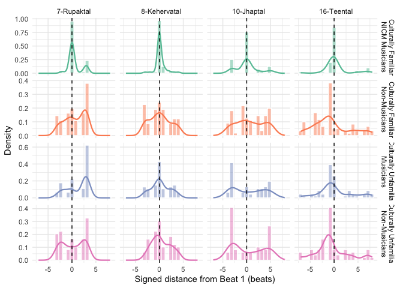<!-- -->

``` r
#ggsave("figuredis.tif", plot = p_raw, dpi = 300, width = 12, height = 8, units = "in")
```

# Test for chance level

## Overall Correct/incorrect

``` r
# Binomial tests
binom_results <- data2 %>%
  mutate(
    p_chance = case_when(
      rhythm_name == "Rupak" ~ 1/7,
      rhythm_name == "Keherva" ~ 1/8,
      rhythm_name == "Jhaptal" ~ 1/10,
      rhythm_name == "Teental" ~ 1/16
    )
  ) %>%
  group_by(Overall_Fam, rhythm_name, p_chance) %>%
  summarise(
    n_trials = n(),
    n_correct = sum(is_correct),
    .groups = 'drop'
  ) %>%
  mutate(
    observed_pct = (n_correct / n_trials) * 100,
    chance_pct = p_chance * 100
  ) %>%
  rowwise() %>%
  mutate(
    p_value = binom.test(n_correct, n_trials, p = p_chance, 
                         alternative = "greater")$p.value,
    ci_lower = binconf(n_correct, n_trials)[2] * 100,
    ci_upper = binconf(n_correct, n_trials)[3] * 100,
    significance = case_when(
      p_value < 0.001 ~ "***",
      p_value < 0.01 ~ "**",
      p_value < 0.05 ~ "*",
      TRUE ~ "ns"
    ),
    above_chance = p_value < 0.05
  ) %>%
  ungroup()

print(binom_results)
```

    ## # A tibble: 16 × 12
    ##    Overall_Fam   rhythm_name p_chance n_trials n_correct observed_pct chance_pct
    ##    <fct>         <chr>          <dbl>    <int>     <int>        <dbl>      <dbl>
    ##  1 Culturally F… Jhaptal       0.1          50        30        60         10   
    ##  2 Culturally F… Keherva       0.125        51        39        76.5       12.5 
    ##  3 Culturally F… Rupak         0.143        49        37        75.5       14.3 
    ##  4 Culturally F… Teental       0.0625       51        34        66.7        6.25
    ##  5 Culturally F… Jhaptal       0.1          70         7        10         10   
    ##  6 Culturally F… Keherva       0.125        73        14        19.2       12.5 
    ##  7 Culturally F… Rupak         0.143        70        11        15.7       14.3 
    ##  8 Culturally F… Teental       0.0625       76         3         3.95       6.25
    ##  9 Culturally U… Jhaptal       0.1          58         6        10.3       10   
    ## 10 Culturally U… Keherva       0.125        59        20        33.9       12.5 
    ## 11 Culturally U… Rupak         0.143        57        10        17.5       14.3 
    ## 12 Culturally U… Teental       0.0625       58        12        20.7        6.25
    ## 13 Culturally U… Jhaptal       0.1          62         3         4.84      10   
    ## 14 Culturally U… Keherva       0.125        62        15        24.2       12.5 
    ## 15 Culturally U… Rupak         0.143        62         8        12.9       14.3 
    ## 16 Culturally U… Teental       0.0625       62         4         6.45       6.25
    ## # ℹ 5 more variables: p_value <dbl>, ci_lower <dbl>, ci_upper <dbl>,
    ## #   significance <chr>, above_chance <lgl>

``` r
# Plot
p_bars <- ggplot(binom_results,
       aes(x = as.character(Overall_Fam), y = observed_pct, fill = above_chance)) +
  geom_col() +
  geom_errorbar(aes(ymin = ci_lower, ymax = ci_upper), width = 0.3) +
  geom_hline(aes(yintercept = chance_pct), 
             linetype = "dashed", color = "red", linewidth = 0.8) +
  geom_text(aes(y = chance_pct + 5, x = 1, 
                label = paste0("Chance=", round(chance_pct, 1), "%")),
            color = "red", size = 3, fontface = "bold", hjust = 0) +
  geom_text(aes(label = significance, y = observed_pct + 8),
            fontface = "bold", size = 4) +
  facet_wrap(~ rhythm_name, ncol = 2, scales = "free") +
  scale_fill_manual(values = c("TRUE" = "darkgreen", "FALSE" = "grey70"),
                    name = "Above Chance") +
  coord_flip() +
  labs(title = "Performance vs. Chance: Each Rhythm Separately",
       subtitle = "Exact binomial tests | Error bars = 95% binomial CIs | Red line = chance",
       x = "", y = "Accuracy (%)") +
  theme_minimal(base_size = 11) +
  theme(plot.title = element_text(face = "bold"),
        strip.text = element_text(face = "bold"),
        legend.position = "bottom",
        axis.text.y = element_text(size = 9))

print(p_bars)
```

<!-- -->

``` r
# Mixed effects model with offset
data2 <- data2 %>%
  mutate(
    baseline_prob = case_when(
      rhythm_name == "Jhaptal" ~ 1/10,
      rhythm_name == "Keherva" ~ 1/8,
      rhythm_name == "Rupak" ~ 1/7,
      rhythm_name == "Teental" ~ 1/16
    ),
    baseline_logit = qlogis(baseline_prob)
  )

# Model 1: Overall test
model1 <- glmer(is_correct ~ 1 + (1|participant_id) + offset(baseline_logit),
                data = data2, family = binomial)

summary(model1)
```

    ## Generalized linear mixed model fit by maximum likelihood (Laplace
    ##   Approximation) [glmerMod]
    ##  Family: binomial  ( logit )
    ## Formula: is_correct ~ 1 + (1 | participant_id) + offset(baseline_logit)
    ##    Data: data2
    ## 
    ##      AIC      BIC   logLik deviance df.resid 
    ##    927.5    937.3   -461.8    923.5      968 
    ## 
    ## Scaled residuals: 
    ##     Min      1Q  Median      3Q     Max 
    ## -1.8332 -0.4660 -0.2694  0.3130  3.3929 
    ## 
    ## Random effects:
    ##  Groups         Name        Variance Std.Dev.
    ##  participant_id (Intercept) 3.448    1.857   
    ## Number of obs: 970, groups:  participant_id, 121
    ## 
    ## Fixed effects:
    ##             Estimate Std. Error z value Pr(>|z|)   
    ## (Intercept)   0.5526     0.2112   2.617  0.00888 **
    ## ---
    ## Signif. codes:  0 '***' 0.001 '**' 0.01 '*' 0.05 '.' 0.1 ' ' 1

``` r
confint(model1, parm = "beta_", method = "Wald")
```

    ##                 2.5 %    97.5 %
    ## (Intercept) 0.1387081 0.9665696

``` r
# Model 2: Group differences
model2 <- glmer(is_correct ~ Overall_Fam * rhythm_name + 
                (1|participant_id) + offset(baseline_logit),
                data = data2,
                family = binomial,
                control = glmerControl(optimizer = "bobyqa"))

summary(model2)
```

    ## Generalized linear mixed model fit by maximum likelihood (Laplace
    ##   Approximation) [glmerMod]
    ##  Family: binomial  ( logit )
    ## Formula: is_correct ~ Overall_Fam * rhythm_name + (1 | participant_id) +  
    ##     offset(baseline_logit)
    ##    Data: data2
    ## Control: glmerControl(optimizer = "bobyqa")
    ## 
    ##      AIC      BIC   logLik deviance df.resid 
    ##    841.5    924.4   -403.8    807.5      953 
    ## 
    ## Scaled residuals: 
    ##     Min      1Q  Median      3Q     Max 
    ## -2.0498 -0.3958 -0.2590  0.2846  5.5766 
    ## 
    ## Random effects:
    ##  Groups         Name        Variance Std.Dev.
    ##  participant_id (Intercept) 1.062    1.03    
    ## Number of obs: 970, groups:  participant_id, 121
    ## 
    ## Fixed effects:
    ##                                                                   Estimate
    ## (Intercept)                                                        2.71814
    ## Overall_FamCulturally Familiar Non-Musicians                      -3.11222
    ## Overall_FamCulturally Unfamiliar Musicians                        -3.03475
    ## Overall_FamCulturally Unfamiliar Non-Musicians                    -3.90887
    ## rhythm_nameKeherva                                                 0.75146
    ## rhythm_nameRupak                                                   0.48462
    ## rhythm_nameTeental                                                 0.92500
    ## Overall_FamCulturally Familiar Non-Musicians:rhythm_nameKeherva   -0.13569
    ## Overall_FamCulturally Unfamiliar Musicians:rhythm_nameKeherva      0.68374
    ## Overall_FamCulturally Unfamiliar Non-Musicians:rhythm_nameKeherva  1.00399
    ## Overall_FamCulturally Familiar Non-Musicians:rhythm_nameRupak     -0.31856
    ## Overall_FamCulturally Unfamiliar Musicians:rhythm_nameRupak       -0.20714
    ## Overall_FamCulturally Unfamiliar Non-Musicians:rhythm_nameRupak    0.24898
    ## Overall_FamCulturally Familiar Non-Musicians:rhythm_nameTeental   -1.42612
    ## Overall_FamCulturally Unfamiliar Musicians:rhythm_nameTeental      0.49071
    ## Overall_FamCulturally Unfamiliar Non-Musicians:rhythm_nameTeental -0.09561
    ##                                                                   Std. Error
    ## (Intercept)                                                          0.39052
    ## Overall_FamCulturally Familiar Non-Musicians                         0.61305
    ## Overall_FamCulturally Unfamiliar Musicians                           0.63787
    ## Overall_FamCulturally Unfamiliar Non-Musicians                       0.75827
    ## rhythm_nameKeherva                                                   0.49676
    ## rhythm_nameRupak                                                     0.49777
    ## rhythm_nameTeental                                                   0.47164
    ## Overall_FamCulturally Familiar Non-Musicians:rhythm_nameKeherva      0.72102
    ## Overall_FamCulturally Unfamiliar Musicians:rhythm_nameKeherva        0.73347
    ## Overall_FamCulturally Unfamiliar Non-Musicians:rhythm_nameKeherva    0.84407
    ## Overall_FamCulturally Familiar Non-Musicians:rhythm_nameRupak        0.73533
    ## Overall_FamCulturally Unfamiliar Musicians:rhythm_nameRupak          0.76453
    ## Overall_FamCulturally Unfamiliar Non-Musicians:rhythm_nameRupak      0.87652
    ## Overall_FamCulturally Familiar Non-Musicians:rhythm_nameTeental      0.87006
    ## Overall_FamCulturally Unfamiliar Musicians:rhythm_nameTeental        0.73689
    ## Overall_FamCulturally Unfamiliar Non-Musicians:rhythm_nameTeental    0.93094
    ##                                                                   z value
    ## (Intercept)                                                         6.960
    ## Overall_FamCulturally Familiar Non-Musicians                       -5.077
    ## Overall_FamCulturally Unfamiliar Musicians                         -4.758
    ## Overall_FamCulturally Unfamiliar Non-Musicians                     -5.155
    ## rhythm_nameKeherva                                                  1.513
    ## rhythm_nameRupak                                                    0.974
    ## rhythm_nameTeental                                                  1.961
    ## Overall_FamCulturally Familiar Non-Musicians:rhythm_nameKeherva    -0.188
    ## Overall_FamCulturally Unfamiliar Musicians:rhythm_nameKeherva       0.932
    ## Overall_FamCulturally Unfamiliar Non-Musicians:rhythm_nameKeherva   1.189
    ## Overall_FamCulturally Familiar Non-Musicians:rhythm_nameRupak      -0.433
    ## Overall_FamCulturally Unfamiliar Musicians:rhythm_nameRupak        -0.271
    ## Overall_FamCulturally Unfamiliar Non-Musicians:rhythm_nameRupak     0.284
    ## Overall_FamCulturally Familiar Non-Musicians:rhythm_nameTeental    -1.639
    ## Overall_FamCulturally Unfamiliar Musicians:rhythm_nameTeental       0.666
    ## Overall_FamCulturally Unfamiliar Non-Musicians:rhythm_nameTeental  -0.103
    ##                                                                   Pr(>|z|)    
    ## (Intercept)                                                       3.39e-12 ***
    ## Overall_FamCulturally Familiar Non-Musicians                      3.84e-07 ***
    ## Overall_FamCulturally Unfamiliar Musicians                        1.96e-06 ***
    ## Overall_FamCulturally Unfamiliar Non-Musicians                    2.54e-07 ***
    ## rhythm_nameKeherva                                                  0.1304    
    ## rhythm_nameRupak                                                    0.3303    
    ## rhythm_nameTeental                                                  0.0499 *  
    ## Overall_FamCulturally Familiar Non-Musicians:rhythm_nameKeherva     0.8507    
    ## Overall_FamCulturally Unfamiliar Musicians:rhythm_nameKeherva       0.3512    
    ## Overall_FamCulturally Unfamiliar Non-Musicians:rhythm_nameKeherva   0.2343    
    ## Overall_FamCulturally Familiar Non-Musicians:rhythm_nameRupak       0.6649    
    ## Overall_FamCulturally Unfamiliar Musicians:rhythm_nameRupak         0.7864    
    ## Overall_FamCulturally Unfamiliar Non-Musicians:rhythm_nameRupak     0.7764    
    ## Overall_FamCulturally Familiar Non-Musicians:rhythm_nameTeental     0.1012    
    ## Overall_FamCulturally Unfamiliar Musicians:rhythm_nameTeental       0.5055    
    ## Overall_FamCulturally Unfamiliar Non-Musicians:rhythm_nameTeental   0.9182    
    ## ---
    ## Signif. codes:  0 '***' 0.001 '**' 0.01 '*' 0.05 '.' 0.1 ' ' 1

    ## 
    ## Correlation matrix not shown by default, as p = 16 > 12.
    ## Use print(x, correlation=TRUE)  or
    ##     vcov(x)        if you need it

``` r
Anova(model2, type = 3)
```

    ## Analysis of Deviance Table (Type III Wald chisquare tests)
    ## 
    ## Response: is_correct
    ##                           Chisq Df Pr(>Chisq)    
    ## (Intercept)             48.4465  1  3.394e-12 ***
    ## Overall_Fam             43.0288  3  2.427e-09 ***
    ## rhythm_name              4.3152  3     0.2294    
    ## Overall_Fam:rhythm_name  8.5502  9     0.4798    
    ## ---
    ## Signif. codes:  0 '***' 0.001 '**' 0.01 '*' 0.05 '.' 0.1 ' ' 1

``` r
# POST-HOC 1: Pairwise group comparisons within each rhythm
emm_rhythm <- emmeans(model2, ~ Overall_Fam | rhythm_name, 
                      type = "response",
                      offset = 0)

posthoc_rhythm <- contrast(emm_rhythm, method = "pairwise", adjust = "tukey")
posthoc_rhythm_summary <- summary(posthoc_rhythm)
print(posthoc_rhythm_summary)
```

    ## rhythm_name = Jhaptal:
    ##  contrast                                                                   
    ##  Culturally Familiar NICM Musicians / (Culturally Familiar Non-Musicians)   
    ##  Culturally Familiar NICM Musicians / Culturally Unfamiliar Musicians       
    ##  Culturally Familiar NICM Musicians / (Culturally Unfamiliar Non-Musicians) 
    ##  (Culturally Familiar Non-Musicians) / Culturally Unfamiliar Musicians      
    ##  (Culturally Familiar Non-Musicians) / (Culturally Unfamiliar Non-Musicians)
    ##  Culturally Unfamiliar Musicians / (Culturally Unfamiliar Non-Musicians)    
    ##  odds.ratio     SE  df null z.ratio p.value
    ##      22.471 13.800 Inf    1   5.077  <.0001
    ##      20.796 13.300 Inf    1   4.758  <.0001
    ##      49.843 37.800 Inf    1   5.155  <.0001
    ##       0.925  0.622 Inf    1  -0.115  0.9995
    ##       2.218  1.740 Inf    1   1.016  0.7402
    ##       2.397  1.930 Inf    1   1.084  0.6995
    ## 
    ## rhythm_name = Keherva:
    ##  contrast                                                                   
    ##  Culturally Familiar NICM Musicians / (Culturally Familiar Non-Musicians)   
    ##  Culturally Familiar NICM Musicians / Culturally Unfamiliar Musicians       
    ##  Culturally Familiar NICM Musicians / (Culturally Unfamiliar Non-Musicians) 
    ##  (Culturally Familiar Non-Musicians) / Culturally Unfamiliar Musicians      
    ##  (Culturally Familiar Non-Musicians) / (Culturally Unfamiliar Non-Musicians)
    ##  Culturally Unfamiliar Musicians / (Culturally Unfamiliar Non-Musicians)    
    ##  odds.ratio     SE  df null z.ratio p.value
    ##      25.736 15.000 Inf    1   5.584  <.0001
    ##      10.496  5.980 Inf    1   4.129  0.0002
    ##      18.263 10.700 Inf    1   4.979  <.0001
    ##       0.408  0.210 Inf    1  -1.745  0.3006
    ##       0.710  0.372 Inf    1  -0.655  0.9138
    ##       1.740  0.902 Inf    1   1.068  0.7092
    ## 
    ## rhythm_name = Rupak:
    ##  contrast                                                                   
    ##  Culturally Familiar NICM Musicians / (Culturally Familiar Non-Musicians)   
    ##  Culturally Familiar NICM Musicians / Culturally Unfamiliar Musicians       
    ##  Culturally Familiar NICM Musicians / (Culturally Unfamiliar Non-Musicians) 
    ##  (Culturally Familiar Non-Musicians) / Culturally Unfamiliar Musicians      
    ##  (Culturally Familiar Non-Musicians) / (Culturally Unfamiliar Non-Musicians)
    ##  Culturally Unfamiliar Musicians / (Culturally Unfamiliar Non-Musicians)    
    ##  odds.ratio     SE  df null z.ratio p.value
    ##      30.901 18.600 Inf    1   5.702  <.0001
    ##      25.582 15.700 Inf    1   5.269  <.0001
    ##      38.857 24.700 Inf    1   5.759  <.0001
    ##       0.828  0.478 Inf    1  -0.327  0.9879
    ##       1.257  0.748 Inf    1   0.385  0.9806
    ##       1.519  0.931 Inf    1   0.682  0.9039
    ## 
    ## rhythm_name = Teental:
    ##  contrast                                                                   
    ##  Culturally Familiar NICM Musicians / (Culturally Familiar Non-Musicians)   
    ##  Culturally Familiar NICM Musicians / Culturally Unfamiliar Musicians       
    ##  Culturally Familiar NICM Musicians / (Culturally Unfamiliar Non-Musicians) 
    ##  (Culturally Familiar Non-Musicians) / Culturally Unfamiliar Musicians      
    ##  (Culturally Familiar Non-Musicians) / (Culturally Unfamiliar Non-Musicians)
    ##  Culturally Unfamiliar Musicians / (Culturally Unfamiliar Non-Musicians)    
    ##  odds.ratio     SE  df null z.ratio p.value
    ##      93.535 71.300 Inf    1   5.953  <.0001
    ##      12.731  7.330 Inf    1   4.416  0.0001
    ##      54.843 39.000 Inf    1   5.638  <.0001
    ##       0.136  0.102 Inf    1  -2.665  0.0385
    ##       0.586  0.498 Inf    1  -0.629  0.9229
    ##       4.308  3.000 Inf    1   2.097  0.1539
    ## 
    ## P value adjustment: tukey method for comparing a family of 4 estimates 
    ## Tests are performed on the log odds ratio scale

``` r
# POST-HOC 2: Pairwise rhythm comparisons within each group
emm_group <- emmeans(model2, ~ rhythm_name | Overall_Fam, 
                     type = "response",
                     offset = 0)

posthoc_group <- contrast(emm_group, method = "pairwise", adjust = "tukey")
posthoc_group_summary <- summary(posthoc_group)
print(posthoc_group_summary)
```

    ## Overall_Fam = Culturally Familiar NICM Musicians:
    ##  contrast          odds.ratio    SE  df null z.ratio p.value
    ##  Jhaptal / Keherva      0.472 0.234 Inf    1  -1.513  0.4298
    ##  Jhaptal / Rupak        0.616 0.307 Inf    1  -0.974  0.7645
    ##  Jhaptal / Teental      0.397 0.187 Inf    1  -1.961  0.2028
    ##  Keherva / Rupak        1.306 0.682 Inf    1   0.511  0.9565
    ##  Keherva / Teental      0.841 0.420 Inf    1  -0.348  0.9856
    ##  Rupak / Teental        0.644 0.323 Inf    1  -0.879  0.8160
    ## 
    ## Overall_Fam = Culturally Familiar Non-Musicians:
    ##  contrast          odds.ratio    SE  df null z.ratio p.value
    ##  Jhaptal / Keherva      0.540 0.284 Inf    1  -1.173  0.6439
    ##  Jhaptal / Rupak        0.847 0.459 Inf    1  -0.306  0.9900
    ##  Jhaptal / Teental      1.651 1.210 Inf    1   0.686  0.9026
    ##  Keherva / Rupak        1.568 0.741 Inf    1   0.951  0.7772
    ##  Keherva / Teental      3.055 2.080 Inf    1   1.640  0.3562
    ##  Rupak / Teental        1.949 1.360 Inf    1   0.959  0.7729
    ## 
    ## Overall_Fam = Culturally Unfamiliar Musicians:
    ##  contrast          odds.ratio    SE  df null z.ratio p.value
    ##  Jhaptal / Keherva      0.238 0.129 Inf    1  -2.641  0.0411
    ##  Jhaptal / Rupak        0.758 0.440 Inf    1  -0.477  0.9641
    ##  Jhaptal / Teental      0.243 0.138 Inf    1  -2.497  0.0604
    ##  Keherva / Rupak        3.183 1.520 Inf    1   2.417  0.0740
    ##  Keherva / Teental      1.020 0.469 Inf    1   0.042  1.0000
    ##  Rupak / Teental        0.320 0.162 Inf    1  -2.246  0.1112
    ## 
    ## Overall_Fam = Culturally Unfamiliar Non-Musicians:
    ##  contrast          odds.ratio    SE  df null z.ratio p.value
    ##  Jhaptal / Keherva      0.173 0.118 Inf    1  -2.561  0.0511
    ##  Jhaptal / Rupak        0.480 0.347 Inf    1  -1.015  0.7404
    ##  Jhaptal / Teental      0.436 0.350 Inf    1  -1.033  0.7300
    ##  Keherva / Rupak        2.778 1.420 Inf    1   1.999  0.1882
    ##  Keherva / Teental      2.525 1.570 Inf    1   1.490  0.4438
    ##  Rupak / Teental        0.909 0.602 Inf    1  -0.145  0.9989
    ## 
    ## P value adjustment: tukey method for comparing a family of 4 estimates 
    ## Tests are performed on the log odds ratio scale

Figure with Glmer results for the first part of the analysis and testing
above chance level performance using z-tet in GLMER

``` r
# Get estimated marginal means from model2
emm_results <- emmeans(model2, ~ Overall_Fam | rhythm_name, 
                       type = "response") %>%
  as.data.frame()

# Add chance levels and calculate z-tests
emm_results <- emm_results %>%
  mutate(
    p_chance = case_when(
      rhythm_name == "Rupak" ~ 1/7,
      rhythm_name == "Keherva" ~ 1/8,
      rhythm_name == "Jhaptal" ~ 1/10,
      rhythm_name == "Teental" ~ 1/16
    ),
    chance_pct = p_chance * 100,
    prob_pct = prob * 100,
    ci_lower = asymp.LCL * 100,
    ci_upper = asymp.UCL * 100,
    # Z-test: (estimate - chance) / SE
    z_stat = (prob - p_chance) / SE,
    p_value = pnorm(z_stat, lower.tail = FALSE),
    significance = case_when(
      p_value < 0.001 ~ "***",
      p_value < 0.01 ~ "**",
      p_value < 0.05 ~ "*",
      TRUE ~ "ns"
    ),
    above_chance = p_value < 0.05
  )

# Create detailed stats table
detailed_stats <- emm_results %>%
  dplyr::select(Overall_Fam, rhythm_name, prob_pct, ci_lower, ci_upper, 
         chance_pct, z_stat, p_value, significance, above_chance) %>%
  arrange(Overall_Fam, rhythm_name) %>%
  mutate(
    p_formatted = case_when(
      p_value < 0.001 ~ "< .001",
      p_value >= 0.001 ~ sprintf("= %.3f", p_value)
    ),
    stats_text = sprintf("z = %.2f, p %s", z_stat, p_formatted)
  )

print(detailed_stats)
```

    ##                            Overall_Fam rhythm_name  prob_pct   ci_lower
    ## 1   Culturally Familiar NICM Musicians     Jhaptal 63.501713 44.7296632
    ## 2   Culturally Familiar NICM Musicians     Keherva 78.671871 61.2032633
    ## 3   Culturally Familiar NICM Musicians       Rupak 73.854565 54.7013580
    ## 4   Culturally Familiar NICM Musicians     Teental 81.439124 66.6258279
    ## 5    Culturally Familiar Non-Musicians     Jhaptal  7.186289  3.0091650
    ## 6    Culturally Familiar Non-Musicians     Keherva 12.535697  6.4491193
    ## 7    Culturally Familiar Non-Musicians       Rupak  8.375764  3.9810932
    ## 8    Culturally Familiar Non-Musicians     Teental  4.480737  1.3222845
    ## 9      Culturally Unfamiliar Musicians     Jhaptal  7.720446  3.0458203
    ## 10     Culturally Unfamiliar Musicians     Keherva 26.004156 14.7620848
    ## 11     Culturally Unfamiliar Musicians       Rupak  9.943980  4.5690415
    ## 12     Culturally Unfamiliar Musicians     Teental 25.630846 13.4847131
    ## 13 Culturally Unfamiliar Non-Musicians     Jhaptal  3.372960  0.9752828
    ## 14 Culturally Unfamiliar Non-Musicians     Keherva 16.803441  8.7740955
    ## 15 Culturally Unfamiliar Non-Musicians       Rupak  6.776987  2.9084912
    ## 16 Culturally Unfamiliar Non-Musicians     Teental  7.407765  2.5179506
    ##    ci_upper chance_pct       z_stat      p_value significance above_chance
    ## 1  78.90490   10.00000  5.911106913 1.699082e-09          ***         TRUE
    ## 2  89.61028   12.50000  9.099967329 4.517950e-20          ***         TRUE
    ## 3  86.85541   14.28571  7.114942184 5.597988e-13          ***         TRUE
    ## 4  90.60464    6.25000 12.380168866 1.673190e-35          ***         TRUE
    ## 5  16.19371   10.00000 -0.904088014 8.170256e-01           ns        FALSE
    ## 6  22.95703   12.50000  0.008718456 4.965219e-01           ns        FALSE
    ## 7  16.77416   14.28571 -1.909066326 9.718732e-01           ns        FALSE
    ## 8  14.10517    6.25000 -0.646641334 7.410680e-01           ns        FALSE
    ## 9  18.22119   10.00000 -0.640232590 7.389893e-01           ns        FALSE
    ## 10 41.62660   12.50000  1.943829392 2.595801e-02            *         TRUE
    ## 11 20.29707   14.28571 -1.137160266 8.722644e-01           ns        FALSE
    ## 12 43.24837    6.25000  2.511350323 6.013514e-03           **         TRUE
    ## 13 11.00982   10.00000 -3.149591719 9.991825e-01           ns        FALSE
    ## 14 29.78181   12.50000  0.813218818 2.080463e-01           ns        FALSE
    ## 15 14.99613   14.28571 -2.627529906 9.956996e-01           ns        FALSE
    ## 16 19.85900    6.25000  0.292629714 3.849026e-01           ns        FALSE
    ##    p_formatted           stats_text
    ## 1       < .001   z = 5.91, p < .001
    ## 2       < .001   z = 9.10, p < .001
    ## 3       < .001   z = 7.11, p < .001
    ## 4       < .001  z = 12.38, p < .001
    ## 5      = 0.817 z = -0.90, p = 0.817
    ## 6      = 0.497  z = 0.01, p = 0.497
    ## 7      = 0.972 z = -1.91, p = 0.972
    ## 8      = 0.741 z = -0.65, p = 0.741
    ## 9      = 0.739 z = -0.64, p = 0.739
    ## 10     = 0.026  z = 1.94, p = 0.026
    ## 11     = 0.872 z = -1.14, p = 0.872
    ## 12     = 0.006  z = 2.51, p = 0.006
    ## 13     = 0.999 z = -3.15, p = 0.999
    ## 14     = 0.208  z = 0.81, p = 0.208
    ## 15     = 0.996 z = -2.63, p = 0.996
    ## 16     = 0.385  z = 0.29, p = 0.385

``` r
emm_results <- emm_results %>%
  mutate(
    rhythm_name = factor(rhythm_name,
      levels = c("Rupak", "Keherva", "Jhaptal", "Teental"),
      labels = c("7-Rupaktal", "8-Kehervatal", "10-Jhaptal", "16-Teental")
    )
  )

# Create the plot
p_glmer <- ggplot(emm_results,
                  aes(x = Overall_Fam, y = prob_pct)) +
  geom_col(aes(fill = above_chance), alpha = 0.85, width = 0.7) +
  geom_errorbar(aes(ymin = ci_lower, ymax = ci_upper), 
                width = 0.35, linewidth = 0.5) +
  geom_hline(aes(yintercept = chance_pct), 
             linetype = "dashed", color = "firebrick", linewidth = 0.6, alpha = 0.8) +
  #geom_text(aes(y = chance_pct + 5, x = 1, 
  #              label = paste0("Chance=", round(chance_pct, 1), "%")),
   #         color = "firebrick", size = 3, fontface = "bold", hjust = 0) +
  geom_text(aes(label = significance, y = prob_pct + 4),
            fontface = "bold", size = 4.5) +
  facet_wrap(~ rhythm_name, ncol = 2, scales = "free") +
  scale_fill_manual(
    values = c("TRUE" = "#1b9e77", "FALSE" = "#bdbdbd"),
    labels = c("TRUE" = "Significantly above chance", "FALSE" = "Not significant"),
    name = NULL
  ) +
  scale_y_continuous(expand = expansion(mult = c(0, 0.12))) +
  coord_flip() +
  labs(
   # title = "GLMER Estimated Marginal Means: Performance vs. Chance",
    #subtitle = "Z-tests against chance | Error bars = 95% CIs | Red line = chance",
    x = NULL,
    y = "Predicted Probability (%)"
  ) +
  theme_minimal(base_size = 11) +
  theme(
    plot.title = element_text(face = "bold"),
    strip.text = element_text(face = "bold", size = 11),
    legend.position = "bottom",
    axis.text.y = element_text(size = 10),
    panel.grid.minor = element_blank(),
    panel.spacing = unit(1, "lines")
  )

print(p_glmer)
```

<!-- -->

``` r
#ggsave("figure1.tif", plot = p_glmer, dpi = 300, width = 12, height = 8, units = "in")
```

# Continuous accuracy analysis

Reviwer 1 Suggestion:Consider adding complementary or control analyses
using continuous measures of accuracy (for example, distance from sam)
to validate or nuance the categorical approach.

``` r
data2 <- data2 %>%
  mutate(
    raw_error = corrected_aligned_beats - 1,
    circular_error = case_when(
      raw_error > beats_per_cycle / 2  ~ raw_error - beats_per_cycle,
      raw_error < -beats_per_cycle / 2 ~ raw_error + beats_per_cycle,
      TRUE ~ raw_error
    ),
    abs_circular_error = abs(circular_error)
  )

model_continuous <- lmer(
  abs_circular_error ~ Overall_Fam * rhythm_name +
    (1 | participant_id),
  data = data2
)

#summary(model_continuous)
car::Anova(model_continuous, type = 3)
```

    ## Analysis of Deviance Table (Type III Wald chisquare tests)
    ## 
    ## Response: abs_circular_error
    ##                          Chisq Df Pr(>Chisq)    
    ## (Intercept)             31.736  1  1.766e-08 ***
    ## Overall_Fam             33.683  3  2.311e-07 ***
    ## rhythm_name             10.535  3    0.01452 *  
    ## Overall_Fam:rhythm_name 11.883  9    0.22000    
    ## ---
    ## Signif. codes:  0 '***' 0.001 '**' 0.01 '*' 0.05 '.' 0.1 ' ' 1

``` r
emmeans(model_continuous, ~ Overall_Fam | rhythm_name)
```

    ## rhythm_name = Jhaptal:
    ##  Overall_Fam                         emmean    SE  df lower.CL upper.CL
    ##  Culturally Familiar NICM Musicians   1.340 0.238 654   0.8729    1.807
    ##  Culturally Familiar Non-Musicians    2.565 0.201 664   2.1701    2.959
    ##  Culturally Unfamiliar Musicians      2.897 0.221 654   2.4629    3.330
    ##  Culturally Unfamiliar Non-Musicians  3.048 0.214 654   2.6289    3.468
    ## 
    ## rhythm_name = Keherva:
    ##  Overall_Fam                         emmean    SE  df lower.CL upper.CL
    ##  Culturally Familiar NICM Musicians   0.428 0.236 641  -0.0356    0.891
    ##  Culturally Familiar Non-Musicians    1.777 0.197 645   1.3902    2.164
    ##  Culturally Unfamiliar Musicians      1.443 0.219 643   1.0128    1.874
    ##  Culturally Unfamiliar Non-Musicians  1.565 0.214 654   1.1451    1.984
    ## 
    ## rhythm_name = Rupak:
    ##  Overall_Fam                         emmean    SE  df lower.CL upper.CL
    ##  Culturally Familiar NICM Musicians   0.677 0.240 663   0.2059    1.149
    ##  Culturally Familiar Non-Musicians    1.893 0.201 664   1.4987    2.288
    ##  Culturally Unfamiliar Musicians      2.138 0.223 662   1.7004    2.575
    ##  Culturally Unfamiliar Non-Musicians  2.016 0.214 654   1.5967    2.436
    ## 
    ## rhythm_name = Teental:
    ##  Overall_Fam                         emmean    SE  df lower.CL upper.CL
    ##  Culturally Familiar NICM Musicians   1.124 0.236 641   0.6604    1.587
    ##  Culturally Familiar Non-Musicians    3.118 0.194 605   2.7360    3.500
    ##  Culturally Unfamiliar Musicians      2.603 0.221 654   2.1698    3.037
    ##  Culturally Unfamiliar Non-Musicians  2.694 0.214 654   2.2741    3.113
    ## 
    ## Degrees-of-freedom method: kenward-roger 
    ## Confidence level used: 0.95

``` r
emmeans(model_continuous, pairwise ~ Overall_Fam | rhythm_name, adjust = "tukey")
```

    ## $emmeans
    ## rhythm_name = Jhaptal:
    ##  Overall_Fam                         emmean    SE  df lower.CL upper.CL
    ##  Culturally Familiar NICM Musicians   1.340 0.238 654   0.8729    1.807
    ##  Culturally Familiar Non-Musicians    2.565 0.201 664   2.1701    2.959
    ##  Culturally Unfamiliar Musicians      2.897 0.221 654   2.4629    3.330
    ##  Culturally Unfamiliar Non-Musicians  3.048 0.214 654   2.6289    3.468
    ## 
    ## rhythm_name = Keherva:
    ##  Overall_Fam                         emmean    SE  df lower.CL upper.CL
    ##  Culturally Familiar NICM Musicians   0.428 0.236 641  -0.0356    0.891
    ##  Culturally Familiar Non-Musicians    1.777 0.197 645   1.3902    2.164
    ##  Culturally Unfamiliar Musicians      1.443 0.219 643   1.0128    1.874
    ##  Culturally Unfamiliar Non-Musicians  1.565 0.214 654   1.1451    1.984
    ## 
    ## rhythm_name = Rupak:
    ##  Overall_Fam                         emmean    SE  df lower.CL upper.CL
    ##  Culturally Familiar NICM Musicians   0.677 0.240 663   0.2059    1.149
    ##  Culturally Familiar Non-Musicians    1.893 0.201 664   1.4987    2.288
    ##  Culturally Unfamiliar Musicians      2.138 0.223 662   1.7004    2.575
    ##  Culturally Unfamiliar Non-Musicians  2.016 0.214 654   1.5967    2.436
    ## 
    ## rhythm_name = Teental:
    ##  Overall_Fam                         emmean    SE  df lower.CL upper.CL
    ##  Culturally Familiar NICM Musicians   1.124 0.236 641   0.6604    1.587
    ##  Culturally Familiar Non-Musicians    3.118 0.194 605   2.7360    3.500
    ##  Culturally Unfamiliar Musicians      2.603 0.221 654   2.1698    3.037
    ##  Culturally Unfamiliar Non-Musicians  2.694 0.214 654   2.2741    3.113
    ## 
    ## Degrees-of-freedom method: kenward-roger 
    ## Confidence level used: 0.95 
    ## 
    ## $contrasts
    ## rhythm_name = Jhaptal:
    ##  contrast                                                                   
    ##  Culturally Familiar NICM Musicians - (Culturally Familiar Non-Musicians)   
    ##  Culturally Familiar NICM Musicians - Culturally Unfamiliar Musicians       
    ##  Culturally Familiar NICM Musicians - (Culturally Unfamiliar Non-Musicians) 
    ##  (Culturally Familiar Non-Musicians) - Culturally Unfamiliar Musicians      
    ##  (Culturally Familiar Non-Musicians) - (Culturally Unfamiliar Non-Musicians)
    ##  Culturally Unfamiliar Musicians - (Culturally Unfamiliar Non-Musicians)    
    ##  estimate    SE  df t.ratio p.value
    ##   -1.2246 0.311 658  -3.933  0.0005
    ##   -1.5566 0.325 654  -4.796  <.0001
    ##   -1.7084 0.320 654  -5.344  <.0001
    ##   -0.3319 0.299 659  -1.112  0.6824
    ##   -0.4838 0.293 659  -1.650  0.3515
    ##   -0.1518 0.307 654  -0.494  0.9604
    ## 
    ## rhythm_name = Keherva:
    ##  contrast                                                                   
    ##  Culturally Familiar NICM Musicians - (Culturally Familiar Non-Musicians)   
    ##  Culturally Familiar NICM Musicians - Culturally Unfamiliar Musicians       
    ##  Culturally Familiar NICM Musicians - (Culturally Unfamiliar Non-Musicians) 
    ##  (Culturally Familiar Non-Musicians) - Culturally Unfamiliar Musicians      
    ##  (Culturally Familiar Non-Musicians) - (Culturally Unfamiliar Non-Musicians)
    ##  Culturally Unfamiliar Musicians - (Culturally Unfamiliar Non-Musicians)    
    ##  estimate    SE  df t.ratio p.value
    ##   -1.3496 0.307 643  -4.390  0.0001
    ##   -1.0157 0.322 642  -3.154  0.0091
    ##   -1.1368 0.318 647  -3.572  0.0021
    ##    0.3339 0.295 644   1.132  0.6696
    ##    0.2127 0.291 650   0.732  0.8843
    ##   -0.1211 0.306 648  -0.396  0.9790
    ## 
    ## rhythm_name = Rupak:
    ##  contrast                                                                   
    ##  Culturally Familiar NICM Musicians - (Culturally Familiar Non-Musicians)   
    ##  Culturally Familiar NICM Musicians - Culturally Unfamiliar Musicians       
    ##  Culturally Familiar NICM Musicians - (Culturally Unfamiliar Non-Musicians) 
    ##  (Culturally Familiar Non-Musicians) - Culturally Unfamiliar Musicians      
    ##  (Culturally Familiar Non-Musicians) - (Culturally Unfamiliar Non-Musicians)
    ##  Culturally Unfamiliar Musicians - (Culturally Unfamiliar Non-Musicians)    
    ##  estimate    SE  df t.ratio p.value
    ##   -1.2159 0.313 664  -3.884  0.0007
    ##   -1.4602 0.327 663  -4.460  0.0001
    ##   -1.3388 0.321 659  -4.166  0.0002
    ##   -0.2444 0.300 663  -0.815  0.8475
    ##   -0.1229 0.293 659  -0.419  0.9752
    ##    0.1214 0.309 658   0.394  0.9793
    ## 
    ## rhythm_name = Teental:
    ##  contrast                                                                   
    ##  Culturally Familiar NICM Musicians - (Culturally Familiar Non-Musicians)   
    ##  Culturally Familiar NICM Musicians - Culturally Unfamiliar Musicians       
    ##  Culturally Familiar NICM Musicians - (Culturally Unfamiliar Non-Musicians) 
    ##  (Culturally Familiar Non-Musicians) - Culturally Unfamiliar Musicians      
    ##  (Culturally Familiar Non-Musicians) - (Culturally Unfamiliar Non-Musicians)
    ##  Culturally Unfamiliar Musicians - (Culturally Unfamiliar Non-Musicians)    
    ##  estimate    SE  df t.ratio p.value
    ##   -1.9941 0.306 626  -6.523  <.0001
    ##   -1.4798 0.323 647  -4.579  <.0001
    ##   -1.5699 0.318 647  -4.933  <.0001
    ##    0.5143 0.294 632   1.748  0.2998
    ##    0.4242 0.289 632   1.469  0.4571
    ##   -0.0901 0.307 654  -0.293  0.9912
    ## 
    ## Degrees-of-freedom method: kenward-roger 
    ## P value adjustment: tukey method for comparing a family of 4 estimates

``` r
emmeans(model_continuous, pairwise ~  rhythm_name | Overall_Fam , adjust = "tukey")
```

    ## $emmeans
    ## Overall_Fam = Culturally Familiar NICM Musicians:
    ##  rhythm_name emmean    SE  df lower.CL upper.CL
    ##  Jhaptal      1.340 0.238 654   0.8729    1.807
    ##  Keherva      0.428 0.236 641  -0.0356    0.891
    ##  Rupak        0.677 0.240 663   0.2059    1.149
    ##  Teental      1.124 0.236 641   0.6604    1.587
    ## 
    ## Overall_Fam = Culturally Familiar Non-Musicians:
    ##  rhythm_name emmean    SE  df lower.CL upper.CL
    ##  Jhaptal      2.565 0.201 664   2.1701    2.959
    ##  Keherva      1.777 0.197 645   1.3902    2.164
    ##  Rupak        1.893 0.201 664   1.4987    2.288
    ##  Teental      3.118 0.194 605   2.7360    3.500
    ## 
    ## Overall_Fam = Culturally Unfamiliar Musicians:
    ##  rhythm_name emmean    SE  df lower.CL upper.CL
    ##  Jhaptal      2.897 0.221 654   2.4629    3.330
    ##  Keherva      1.443 0.219 643   1.0128    1.874
    ##  Rupak        2.138 0.223 662   1.7004    2.575
    ##  Teental      2.603 0.221 654   2.1698    3.037
    ## 
    ## Overall_Fam = Culturally Unfamiliar Non-Musicians:
    ##  rhythm_name emmean    SE  df lower.CL upper.CL
    ##  Jhaptal      3.048 0.214 654   2.6289    3.468
    ##  Keherva      1.565 0.214 654   1.1451    1.984
    ##  Rupak        2.016 0.214 654   1.5967    2.436
    ##  Teental      2.694 0.214 654   2.2741    3.113
    ## 
    ## Degrees-of-freedom method: kenward-roger 
    ## Confidence level used: 0.95 
    ## 
    ## $contrasts
    ## Overall_Fam = Culturally Familiar NICM Musicians:
    ##  contrast          estimate    SE  df t.ratio p.value
    ##  Jhaptal - Keherva    0.912 0.313 838   2.916  0.0190
    ##  Jhaptal - Rupak      0.663 0.316 838   2.097  0.1549
    ##  Jhaptal - Teental    0.216 0.313 838   0.691  0.9004
    ##  Keherva - Rupak     -0.250 0.315 842  -0.793  0.8575
    ##  Keherva - Teental   -0.696 0.311 839  -2.235  0.1146
    ##  Rupak - Teental     -0.446 0.315 839  -1.419  0.4876
    ## 
    ## Overall_Fam = Culturally Familiar Non-Musicians:
    ##  contrast          estimate    SE  df t.ratio p.value
    ##  Jhaptal - Keherva    0.787 0.263 845   2.991  0.0152
    ##  Jhaptal - Rupak      0.671 0.266 837   2.527  0.0565
    ##  Jhaptal - Teental   -0.553 0.262 865  -2.113  0.1497
    ##  Keherva - Rupak     -0.116 0.263 845  -0.440  0.9714
    ##  Keherva - Teental   -1.341 0.258 844  -5.198  <.0001
    ##  Rupak - Teental     -1.225 0.262 865  -4.678  <.0001
    ## 
    ## Overall_Fam = Culturally Unfamiliar Musicians:
    ##  contrast          estimate    SE  df t.ratio p.value
    ##  Jhaptal - Keherva    1.453 0.291 838   5.000  <.0001
    ##  Jhaptal - Rupak      0.759 0.293 838   2.589  0.0481
    ##  Jhaptal - Teental    0.293 0.292 837   1.004  0.7469
    ##  Keherva - Rupak     -0.694 0.292 841  -2.376  0.0824
    ##  Keherva - Teental   -1.160 0.291 838  -3.991  0.0004
    ##  Rupak - Teental     -0.466 0.293 838  -1.589  0.3854
    ## 
    ## Overall_Fam = Culturally Unfamiliar Non-Musicians:
    ##  contrast          estimate    SE  df t.ratio p.value
    ##  Jhaptal - Keherva    1.484 0.282 837   5.257  <.0001
    ##  Jhaptal - Rupak      1.032 0.282 837   3.657  0.0015
    ##  Jhaptal - Teental    0.355 0.282 837   1.257  0.5906
    ##  Keherva - Rupak     -0.452 0.282 837  -1.600  0.3792
    ##  Keherva - Teental   -1.129 0.282 837  -4.000  0.0004
    ##  Rupak - Teental     -0.677 0.282 837  -2.400  0.0779
    ## 
    ## Degrees-of-freedom method: kenward-roger 
    ## P value adjustment: tukey method for comparing a family of 4 estimates

# 2. Focusing on participant responses

Doing it manually: Template 1: where the emphasis/ accents is Rupak: \[0
0 0, 1 0, 1 0\] Keherva: \[1, 0, 1, 0, 1, 0, 0, 1\] Jhaptal: \[1, 0, 1,
1, 0, 1, 0, 1, 1, 0\] Teental: \[1, 0, 0, 1, 1, 0, 0, 1, 1, 0,0,0,
0,0,0,1\]

Template 2: Consecutive beats, where 2 emphaisis occur at the same time
Rupak= c(0, 0, 0, 1, 0, 0, 0) \#This becomes a special case where the
first accent occurs on beat 4

Keherva= c(0, 0, 0, 0, 0, 0, 0, 1) Jhaptal= c(0, 0, 1, 0, 0, 0, 0, 1, 0,
0) Teental= c(0, 0, 0, 1, 0, 0, 0, 1, 0, 0, 0, 0, 0, 0, 0, 1)

Template 3: Chunking hypothesis, except the beat 1 position Rupak= c(0,
0, 0, 1, 0, 1, 0) Keherva= c(0, 0, 0, 0, 1, 0, 0, 0) Jhaptal= c(0, 0, 0,
1, 0, 1, 0, 0, 1, 0) Teental= c(0, 0, 0, 0, 1, 0, 0, 0, 1, 0, 0, 0, 1,
0, 0, 0)

\##Looking at the data

``` r
# Manual Template for onsets
Rupak= c(0, 0, 0, 1, 0, 1, 0)
Keherva= c(1, 0, 1, 0, 1, 0, 0, 1)
Jhaptal= c(1, 0, 1, 1, 0, 0, 0, 1, 1, 0)
Teental= c(1, 0, 0, 1, 1, 0, 0, 1, 1, 0, 0, 0, 0, 0, 0, 1)


S<-data2 %>%
 group_by(rhythm_name, Overall_Fam, corrected_aligned_beats) %>%
 summarise(N=n())
```

    ## `summarise()` has grouped output by 'rhythm_name', 'Overall_Fam'. You can
    ## override using the `.groups` argument.

``` r
S
```

    ## # A tibble: 141 × 4
    ## # Groups:   rhythm_name, Overall_Fam [16]
    ##    rhythm_name Overall_Fam                        corrected_aligned_beats     N
    ##    <chr>       <fct>                                                <dbl> <int>
    ##  1 Jhaptal     Culturally Familiar NICM Musicians                       1    30
    ##  2 Jhaptal     Culturally Familiar NICM Musicians                       3     3
    ##  3 Jhaptal     Culturally Familiar NICM Musicians                       4     2
    ##  4 Jhaptal     Culturally Familiar NICM Musicians                       6     5
    ##  5 Jhaptal     Culturally Familiar NICM Musicians                       8    10
    ##  6 Jhaptal     Culturally Familiar Non-Musicians                        1     7
    ##  7 Jhaptal     Culturally Familiar Non-Musicians                        2     6
    ##  8 Jhaptal     Culturally Familiar Non-Musicians                        3     8
    ##  9 Jhaptal     Culturally Familiar Non-Musicians                        4     2
    ## 10 Jhaptal     Culturally Familiar Non-Musicians                        5     8
    ## # ℹ 131 more rows

``` r
g1<-ggplot(S,aes(x=corrected_aligned_beats,y=N))+
  geom_col()+
  facet_wrap(rhythm_name~Overall_Fam,scales="free_x")+
  theme_classic()
g1  
```

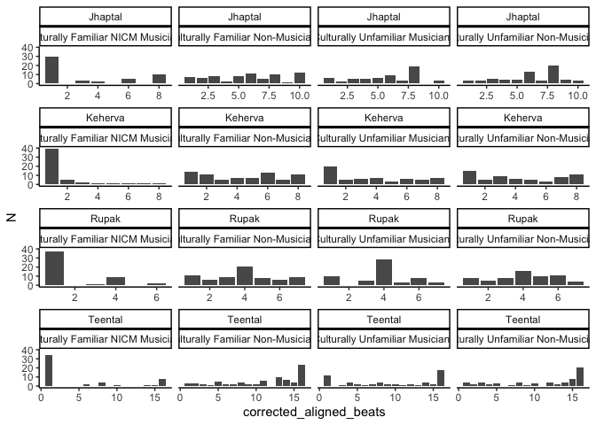<!-- -->

``` r
S$template<-NA

# trying to apply template to the data
S$template[S$rhythm_name=="Rupak"] <- Rupak[S$corrected_aligned_beats[S$rhythm_name=="Rupak"]]
S$template[S$rhythm_name=="Keherva"] <- Keherva[S$corrected_aligned_beats[S$rhythm_name=="Keherva"]]
S$template[S$rhythm_name=="Jhaptal"] <- Jhaptal[S$corrected_aligned_beats[S$rhythm_name=="Jhaptal"]]
S$template[S$rhythm_name=="Teental"] <- Teental[S$corrected_aligned_beats[S$rhythm_name=="Teental"]]

g1<-ggplot(S,aes(x=corrected_aligned_beats,y=N))+
  geom_col()+
  geom_point(aes(x=corrected_aligned_beats,y=template*30,color="red"))+
  facet_wrap(rhythm_name~Overall_Fam,scales="free_x")+
  theme_classic()
g1  
```

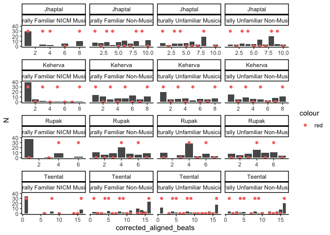<!-- -->

``` r
# 2. consecutive beats as an extra bottom up explanation
Rupak= c(0, 0, 0, 1, 0, 0, 0) #This becomes a special case where the first accent occurs on beat 4 and there are no consetive beats
Keherva= c(0, 0, 0, 0, 0, 0, 0, 1)
Jhaptal= c(0, 0, 1, 0, 0, 0, 0, 1, 0, 0)
Teental= c(0, 0, 0, 1, 0, 0, 0, 1, 0, 0, 0, 0, 0, 0, 0, 1)

SS<-S %>%
 group_by(rhythm_name, corrected_aligned_beats, Overall_Fam, template) %>%
 summarise(Nsummed_per=sum(N))
```

    ## `summarise()` has grouped output by 'rhythm_name', 'corrected_aligned_beats',
    ## 'Overall_Fam'. You can override using the `.groups` argument.

``` r
SS
```

    ## # A tibble: 141 × 5
    ## # Groups:   rhythm_name, corrected_aligned_beats, Overall_Fam [141]
    ##    rhythm_name corrected_aligned_beats Overall_Fam          template Nsummed_per
    ##    <chr>                         <dbl> <fct>                   <dbl>       <int>
    ##  1 Jhaptal                           1 Culturally Familiar…        1          30
    ##  2 Jhaptal                           1 Culturally Familiar…        1           7
    ##  3 Jhaptal                           1 Culturally Unfamili…        1           6
    ##  4 Jhaptal                           1 Culturally Unfamili…        1           3
    ##  5 Jhaptal                           2 Culturally Familiar…        0           6
    ##  6 Jhaptal                           2 Culturally Unfamili…        0           2
    ##  7 Jhaptal                           2 Culturally Unfamili…        0           3
    ##  8 Jhaptal                           3 Culturally Familiar…        1           3
    ##  9 Jhaptal                           3 Culturally Familiar…        1           8
    ## 10 Jhaptal                           3 Culturally Unfamili…        1           5
    ## # ℹ 131 more rows

``` r
SS$template2<-NA

SS$template2[SS$rhythm_name=="Rupak"] <- Rupak[SS$corrected_aligned_beats[SS$rhythm_name=="Rupak"]]
SS$template2[SS$rhythm_name=="Keherva"] <- Keherva[SS$corrected_aligned_beats[SS$rhythm_name=="Keherva"]]
SS$template2[SS$rhythm_name=="Jhaptal"] <- Jhaptal[SS$corrected_aligned_beats[SS$rhythm_name=="Jhaptal"]]
SS$template2[SS$rhythm_name=="Teental"] <- Teental[SS$corrected_aligned_beats[SS$rhythm_name=="Teental"]]

g2 <- ggplot(SS, aes(x = corrected_aligned_beats, y = Nsummed_per)) +
  geom_col() +
  #geom_point(aes(y = template * 30, color = "Beat onsets overall"), size = 2) +
  geom_point(aes(y = template2 * 30, color = "Consecutive beats"), size = 2) +
  scale_color_manual(  values = c("Consecutive beats" = "blue")) +
  facet_wrap(rhythm_name ~ Overall_Fam, scales = "free_x") +
  theme_classic() +
  theme(legend.position = "bottom")

g2
```

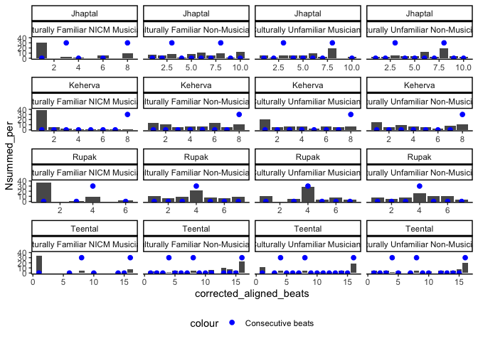<!-- -->

``` r
# 3. Chunking groups that we had in paper 3.: Template 3
Rupak= c(1, 0, 0, 1, 0, 1, 0)
Keherva= c(1, 0, 0, 0, 1, 0, 0, 0)
Jhaptal= c(1, 0, 1, 0, 0, 1, 0, 1, 0, 0)
Teental= c(1, 0, 0, 0, 1, 0, 0, 0, 1, 0, 0, 0, 1, 0, 0, 0)

SSS<-SS %>%
 group_by(rhythm_name, corrected_aligned_beats, Overall_Fam, template, template2) %>%
 summarise(Nsummed_per2=sum(Nsummed_per))
```

    ## `summarise()` has grouped output by 'rhythm_name', 'corrected_aligned_beats',
    ## 'Overall_Fam', 'template'. You can override using the `.groups` argument.

``` r
SSS
```

    ## # A tibble: 141 × 6
    ## # Groups:   rhythm_name, corrected_aligned_beats, Overall_Fam, template [141]
    ##    rhythm_name corrected_aligned_beats Overall_Fam            template template2
    ##    <chr>                         <dbl> <fct>                     <dbl>     <dbl>
    ##  1 Jhaptal                           1 Culturally Familiar N…        1         0
    ##  2 Jhaptal                           1 Culturally Familiar N…        1         0
    ##  3 Jhaptal                           1 Culturally Unfamiliar…        1         0
    ##  4 Jhaptal                           1 Culturally Unfamiliar…        1         0
    ##  5 Jhaptal                           2 Culturally Familiar N…        0         0
    ##  6 Jhaptal                           2 Culturally Unfamiliar…        0         0
    ##  7 Jhaptal                           2 Culturally Unfamiliar…        0         0
    ##  8 Jhaptal                           3 Culturally Familiar N…        1         1
    ##  9 Jhaptal                           3 Culturally Familiar N…        1         1
    ## 10 Jhaptal                           3 Culturally Unfamiliar…        1         1
    ## # ℹ 131 more rows
    ## # ℹ 1 more variable: Nsummed_per2 <int>

``` r
SSS$template3<-NA

SSS$template3[SSS$rhythm_name=="Rupak"] <- Rupak[SSS$corrected_aligned_beats[SSS$rhythm_name=="Rupak"]]
SSS$template3[SSS$rhythm_name=="Keherva"] <- Keherva[SSS$corrected_aligned_beats[SSS$rhythm_name=="Keherva"]]
SSS$template3[SSS$rhythm_name=="Jhaptal"] <- Jhaptal[SSS$corrected_aligned_beats[SSS$rhythm_name=="Jhaptal"]]
SSS$template3[SSS$rhythm_name=="Teental"] <- Teental[SSS$corrected_aligned_beats[SSS$rhythm_name=="Teental"]]

g3 <- ggplot(SSS, aes(x = corrected_aligned_beats, y = Nsummed_per2)) +
  geom_col() +
  #geom_point(aes(y = template * 30, color = "Beat onsets overall"), size = 2) +
  geom_point(aes(y = template3 * 30, color = "Consecutive beats"), size = 2) +
  scale_color_manual(  values = c("Consecutive beats" = "green")) +
  facet_wrap(rhythm_name ~ Overall_Fam, scales = "free_x") +
  theme_classic() +
  theme(legend.position = "bottom")

g3
```

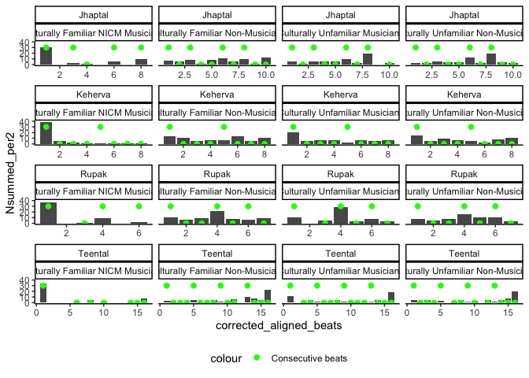<!-- -->

``` r
# 4. weak to strong: Template 4
Rupak= c(0, 0, 0, 1, 0, 0, 0)
Keherva= c(0, 0, 0, 0, 0, 0, 0, 1)
Jhaptal= c(0, 0, 0, 0, 0, 0, 0, 1, 0, 0)
Teental= c(0, 0, 0, 0, 0, 0, 0, 0, 0, 0, 0, 0, 0, 0, 0, 1)


SSSS <- SSS %>%
  group_by(rhythm_name, corrected_aligned_beats, Overall_Fam, template, template2, template3) %>%
  summarise(Nsummed_per3 = sum(Nsummed_per2))
```

    ## `summarise()` has grouped output by 'rhythm_name', 'corrected_aligned_beats',
    ## 'Overall_Fam', 'template', 'template2'. You can override using the `.groups`
    ## argument.

``` r
SSSS$template4 <- NA
SSSS$template4[SSSS$rhythm_name == "Rupak"] <- Rupak[SSSS$corrected_aligned_beats[SSSS$rhythm_name == "Rupak"]]
SSSS$template4[SSSS$rhythm_name == "Keherva"] <- Keherva[SSSS$corrected_aligned_beats[SSSS$rhythm_name == "Keherva"]]
SSSS$template4[SSSS$rhythm_name == "Jhaptal"] <- Jhaptal[SSSS$corrected_aligned_beats[SSSS$rhythm_name == "Jhaptal"]]
SSSS$template4[SSSS$rhythm_name == "Teental"] <- Teental[SSSS$corrected_aligned_beats[SSSS$rhythm_name == "Teental"]]

g4 <- ggplot(SSSS, aes(x = corrected_aligned_beats, y = Nsummed_per3)) +
  geom_col() +
  geom_point(aes(y = template4 * 30, color = "Consecutive beats"), size = 2) +
  scale_color_manual(values = c("Consecutive beats" = "pink")) +
  facet_wrap(rhythm_name ~ Overall_Fam, scales = "free_x") +
  theme_classic() +
  theme(legend.position = "bottom")
g4
```

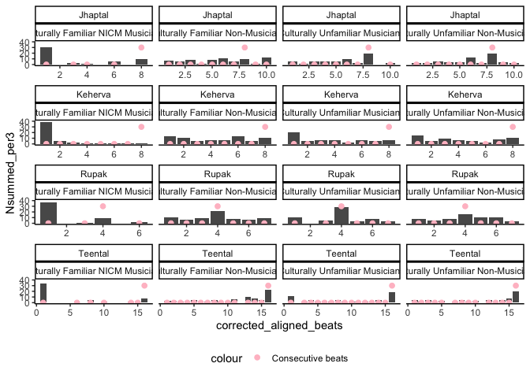<!-- -->

``` r
#marking for all the above
g5 <- ggplot(SSS, aes(x = corrected_aligned_beats, y = Nsummed_per2)) +
  geom_col() +
  geom_point(data = SSS %>% filter(template == 1), 
             aes(y = template * 30, color = "Beat onsets overall"), size = 2) +
  geom_point(data = SSS %>% filter(template2 == 1), 
             aes(y = template2 * 30, color = "Consecutive beats"), size = 2) +
  geom_point(data = SSS %>% filter(template3 == 1), 
             aes(y = template3 * 30, color = "Chunking categories"), size = 2) +
  scale_color_manual(
    values = c("Beat onsets overall" = "red", 
               "Consecutive beats" = "blue", 
               "Chunking categories" = "green",
               "Chunking categories" = "pink")) +
  facet_wrap(rhythm_name ~ Overall_Fam, scales = "free_x") +
  theme_classic() +
  theme(legend.position = "bottom")

g5
```

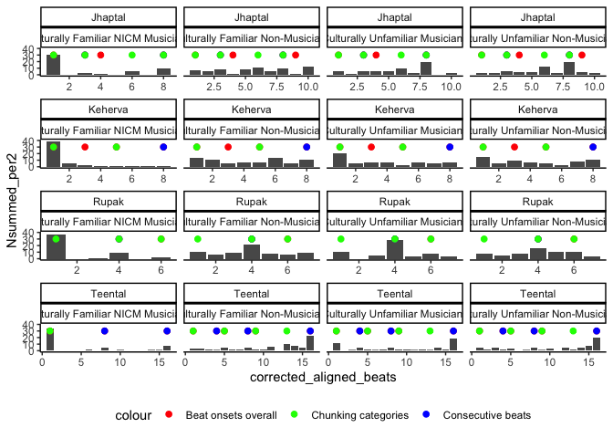<!-- -->

Binomial tests for each template

``` r
# Filter out Indian NICM_musicians
Sb <- SSSS %>% filter(Overall_Fam != "Culturally Familiar NICM Musicians")

# Step 1: Calculate expected probabilities for each rhythm
template_probs <- Sb %>%
  group_by(rhythm_name) %>%
  summarise(
    p_template1 = mean(template, na.rm = TRUE),   # Proportion where template = 1
    p_template2 = mean(template2, na.rm = TRUE),   # Proportion where template2 = 1
    p_template3 = mean(template3, na.rm = TRUE),   # Proportion where template3 = 1
    p_template4 = mean(template4, na.rm = TRUE)    # Proportion where template4 = 1
  )

# Binomial for Beat onsets overall (with template)
binom_template1 <- Sb %>%
  left_join(template_probs, by = "rhythm_name") %>%
  group_by(Overall_Fam, rhythm_name, p_template1) %>%
  summarise(
    n_total_responses = sum(Nsummed_per3),
    n_at_template = sum(Nsummed_per3[template == 1]),
    .groups = 'drop'
  ) %>%
  mutate(
    observed_pct = (n_at_template / n_total_responses) * 100,
    chance_pct = p_template1 * 100
  ) %>%
  rowwise() %>%
  mutate(
    p_value = binom.test(n_at_template, n_total_responses, 
                        p = p_template1, alternative = "greater")$p.value,
    ci_lower = binconf(n_at_template, n_total_responses)[2] * 100,
    ci_upper = binconf(n_at_template, n_total_responses)[3] * 100,
    significance = case_when(
      p_value < 0.001 ~ "***",
      p_value < 0.01 ~ "**",
      p_value < 0.05 ~ "*",
      TRUE ~ "ns"
    ),
    above_chance = p_value < 0.05
  ) %>%
  ungroup()

print(binom_template1)
```

    ## # A tibble: 12 × 12
    ##    Overall_Fam           rhythm_name p_template1 n_total_responses n_at_template
    ##    <fct>                 <chr>             <dbl>             <int>         <int>
    ##  1 Culturally Familiar … Jhaptal           0.483                70            28
    ##  2 Culturally Familiar … Keherva           0.5                  73            37
    ##  3 Culturally Familiar … Rupak             0.3                  70            27
    ##  4 Culturally Familiar … Teental           0.409                76            38
    ##  5 Culturally Unfamilia… Jhaptal           0.483                58            35
    ##  6 Culturally Unfamilia… Keherva           0.5                  59            36
    ##  7 Culturally Unfamilia… Rupak             0.3                  57            36
    ##  8 Culturally Unfamilia… Teental           0.409                58            42
    ##  9 Culturally Unfamilia… Jhaptal           0.483                62            36
    ## 10 Culturally Unfamilia… Keherva           0.5                  62            40
    ## 11 Culturally Unfamilia… Rupak             0.3                  62            27
    ## 12 Culturally Unfamilia… Teental           0.409                62            34
    ## # ℹ 7 more variables: observed_pct <dbl>, chance_pct <dbl>, p_value <dbl>,
    ## #   ci_lower <dbl>, ci_upper <dbl>, significance <chr>, above_chance <lgl>

``` r
# # Binomial for Beat forConsecutive beats (template 2)
binom_template2 <- Sb %>%
  left_join(template_probs, by = "rhythm_name") %>%
  group_by(Overall_Fam, rhythm_name, p_template2) %>%
  summarise(
    n_total_responses = sum(Nsummed_per3),
    n_at_template = sum(Nsummed_per3[template2 == 1]),
    .groups = 'drop'
  ) %>%
  mutate(
    observed_pct = (n_at_template / n_total_responses) * 100,
    chance_pct = p_template2 * 100
  ) %>%
  rowwise() %>%
  mutate(
    p_value = binom.test(n_at_template, n_total_responses, 
                        p = p_template2, alternative = "greater")$p.value,
    ci_lower = binconf(n_at_template, n_total_responses)[2] * 100,
    ci_upper = binconf(n_at_template, n_total_responses)[3] * 100,
    significance = case_when(
      p_value < 0.001 ~ "***",
      p_value < 0.01 ~ "**",
      p_value < 0.05 ~ "*",
      TRUE ~ "ns"
    ),
    above_chance = p_value < 0.05
  ) %>%
  ungroup()

print(binom_template2)
```

    ## # A tibble: 12 × 12
    ##    Overall_Fam           rhythm_name p_template2 n_total_responses n_at_template
    ##    <fct>                 <chr>             <dbl>             <int>         <int>
    ##  1 Culturally Familiar … Jhaptal           0.207                70            18
    ##  2 Culturally Familiar … Keherva           0.125                73            11
    ##  3 Culturally Familiar … Rupak             0.15                 70            21
    ##  4 Culturally Familiar … Teental           0.205                76            28
    ##  5 Culturally Unfamilia… Jhaptal           0.207                58            24
    ##  6 Culturally Unfamilia… Keherva           0.125                59             7
    ##  7 Culturally Unfamilia… Rupak             0.15                 57            28
    ##  8 Culturally Unfamilia… Teental           0.205                58            26
    ##  9 Culturally Unfamilia… Jhaptal           0.207                62            25
    ## 10 Culturally Unfamilia… Keherva           0.125                62            11
    ## 11 Culturally Unfamilia… Rupak             0.15                 62            16
    ## 12 Culturally Unfamilia… Teental           0.205                62            26
    ## # ℹ 7 more variables: observed_pct <dbl>, chance_pct <dbl>, p_value <dbl>,
    ## #   ci_lower <dbl>, ci_upper <dbl>, significance <chr>, above_chance <lgl>

``` r
# Binomial for Chunking (template 3)
binom_template3 <- Sb %>%
  left_join(template_probs, by = "rhythm_name") %>%
  group_by(Overall_Fam, rhythm_name, p_template3) %>%
  summarise(
    n_total_responses = sum(Nsummed_per3),
    n_at_template = sum(Nsummed_per3[template3 == 1]),
    .groups = 'drop'
  ) %>%
  mutate(
    observed_pct = (n_at_template / n_total_responses) * 100,
    chance_pct = p_template3 * 100
  ) %>%
  rowwise() %>%
  mutate(
    p_value = binom.test(n_at_template, n_total_responses, 
                        p = p_template3, alternative = "greater")$p.value,
    ci_lower = binconf(n_at_template, n_total_responses)[2] * 100,
    ci_upper = binconf(n_at_template, n_total_responses)[3] * 100,
    significance = case_when(
      p_value < 0.001 ~ "***",
      p_value < 0.01 ~ "**",
      p_value < 0.05 ~ "*",
      TRUE ~ "ns"
    ),
    above_chance = p_value < 0.05
  ) %>%
  ungroup()

print(binom_template3)
```

    ## # A tibble: 12 × 12
    ##    Overall_Fam           rhythm_name p_template3 n_total_responses n_at_template
    ##    <fct>                 <chr>             <dbl>             <int>         <int>
    ##  1 Culturally Familiar … Jhaptal           0.414                70            36
    ##  2 Culturally Familiar … Keherva           0.25                 73            21
    ##  3 Culturally Familiar … Rupak             0.45                 70            38
    ##  4 Culturally Familiar … Teental           0.273                76            20
    ##  5 Culturally Unfamilia… Jhaptal           0.414                58            39
    ##  6 Culturally Unfamilia… Keherva           0.25                 59            23
    ##  7 Culturally Unfamilia… Rupak             0.45                 57            46
    ##  8 Culturally Unfamilia… Teental           0.273                58            17
    ##  9 Culturally Unfamilia… Jhaptal           0.414                62            41
    ## 10 Culturally Unfamilia… Keherva           0.25                 62            20
    ## 11 Culturally Unfamilia… Rupak             0.45                 62            35
    ## 12 Culturally Unfamilia… Teental           0.273                62            10
    ## # ℹ 7 more variables: observed_pct <dbl>, chance_pct <dbl>, p_value <dbl>,
    ## #   ci_lower <dbl>, ci_upper <dbl>, significance <chr>, above_chance <lgl>

``` r
# Binomial for weak to straong (template 4)
binom_template4 <- Sb %>%
  left_join(template_probs, by = "rhythm_name") %>%
  group_by(Overall_Fam, rhythm_name, p_template4) %>%
  summarise(
    n_total_responses = sum(Nsummed_per3),
    n_at_template = sum(Nsummed_per3[template4 == 1]),
    .groups = 'drop'
  ) %>%
  mutate(
    observed_pct = (n_at_template / n_total_responses) * 100,
    chance_pct = p_template4 * 100
  ) %>%
  rowwise() %>%
  mutate(
    p_value = binom.test(n_at_template, n_total_responses, 
                        p = p_template4, alternative = "greater")$p.value,
    ci_lower = binconf(n_at_template, n_total_responses)[2] * 100,
    ci_upper = binconf(n_at_template, n_total_responses)[3] * 100,
    significance = case_when(
      p_value < 0.001 ~ "***",
      p_value < 0.01 ~ "**",
      p_value < 0.05 ~ "*",
      TRUE ~ "ns"
    ),
    above_chance = p_value < 0.05
  ) %>%
  ungroup()
print(binom_template4)
```

    ## # A tibble: 12 × 12
    ##    Overall_Fam           rhythm_name p_template4 n_total_responses n_at_template
    ##    <fct>                 <chr>             <dbl>             <int>         <int>
    ##  1 Culturally Familiar … Jhaptal          0.103                 70            10
    ##  2 Culturally Familiar … Keherva          0.125                 73            11
    ##  3 Culturally Familiar … Rupak            0.15                  70            21
    ##  4 Culturally Familiar … Teental          0.0682                76            23
    ##  5 Culturally Unfamilia… Jhaptal          0.103                 58            19
    ##  6 Culturally Unfamilia… Keherva          0.125                 59             7
    ##  7 Culturally Unfamilia… Rupak            0.15                  57            28
    ##  8 Culturally Unfamilia… Teental          0.0682                58            18
    ##  9 Culturally Unfamilia… Jhaptal          0.103                 62            20
    ## 10 Culturally Unfamilia… Keherva          0.125                 62            11
    ## 11 Culturally Unfamilia… Rupak            0.15                  62            16
    ## 12 Culturally Unfamilia… Teental          0.0682                62            20
    ## # ℹ 7 more variables: observed_pct <dbl>, chance_pct <dbl>, p_value <dbl>,
    ## #   ci_lower <dbl>, ci_upper <dbl>, significance <chr>, above_chance <lgl>

Some questions: Now, how do I check which one predicts the responses the
best? Should I use glmer? Should i check with MIR if any of the features
predict participant responses?

## 1. Which template 1,2,3 predict responses the best

``` r
#modelling each of them

#problem Sb, has summed responses and not participant responses. So, putting the three templates in data2
# Template 1
Rupak1   <- c(0, 0, 0, 1, 0, 1, 0)
Keherva1 <- c(1, 0, 1, 0, 1, 0, 0, 1)
Jhaptal1 <- c(1, 0, 1, 1, 0, 0, 0, 1, 1, 0)
Teental1 <- c(1, 0, 0, 1, 1, 0, 0, 1, 1, 0, 0, 0, 0, 0, 0, 1)

data2$template[data2$rhythm_name == "Rupak"]   <- Rupak1[data2$corrected_aligned_beats[data2$rhythm_name == "Rupak"]]
```

    ## Warning: Unknown or uninitialised column: `template`.

``` r
data2$template[data2$rhythm_name == "Keherva"] <- Keherva1[data2$corrected_aligned_beats[data2$rhythm_name == "Keherva"]]
data2$template[data2$rhythm_name == "Jhaptal"] <- Jhaptal1[data2$corrected_aligned_beats[data2$rhythm_name == "Jhaptal"]]
data2$template[data2$rhythm_name == "Teental"] <- Teental1[data2$corrected_aligned_beats[data2$rhythm_name == "Teental"]]

# Template 2
Rupak2   <- c(0, 0, 0, 1, 0, 0, 0)
Keherva2 <- c(0, 0, 0, 0, 0, 0, 0, 1)
Jhaptal2 <- c(0, 0, 1, 0, 0, 0, 0, 1, 0, 0)
Teental2 <- c(0, 0, 0, 1, 0, 0, 0, 1, 0, 0, 0, 0, 0, 0, 0, 1)

data2$template2[data2$rhythm_name == "Rupak"]   <- Rupak2[data2$corrected_aligned_beats[data2$rhythm_name == "Rupak"]]
```

    ## Warning: Unknown or uninitialised column: `template2`.

``` r
data2$template2[data2$rhythm_name == "Keherva"] <- Keherva2[data2$corrected_aligned_beats[data2$rhythm_name == "Keherva"]]
data2$template2[data2$rhythm_name == "Jhaptal"] <- Jhaptal2[data2$corrected_aligned_beats[data2$rhythm_name == "Jhaptal"]]
data2$template2[data2$rhythm_name == "Teental"] <- Teental2[data2$corrected_aligned_beats[data2$rhythm_name == "Teental"]]

# Template 3: Chunking categories
Rupak3 <- c(1, 0, 0, 1, 0, 1, 0)
Keherva3 <- c(1, 0, 0, 0, 1, 0, 0, 0)
Jhaptal3 <- c(1, 0, 1, 0, 0, 1, 0, 1, 0, 0)
Teental3 <- c(1, 0, 0, 0, 1, 0, 0, 0, 1, 0, 0, 0, 1, 0, 0, 0)

data2$template3 <- NA
data2$template3[data2$rhythm_name == "Rupak"] <- Rupak3[data2$corrected_aligned_beats[data2$rhythm_name == "Rupak"]]
data2$template3[data2$rhythm_name == "Keherva"] <- Keherva3[data2$corrected_aligned_beats[data2$rhythm_name == "Keherva"]]
data2$template3[data2$rhythm_name == "Jhaptal"] <- Jhaptal3[data2$corrected_aligned_beats[data2$rhythm_name == "Jhaptal"]]
data2$template3[data2$rhythm_name == "Teental"] <- Teental3[data2$corrected_aligned_beats[data2$rhythm_name == "Teental"]]

#Template 4
Rupak= c(0, 0, 0, 1, 0, 0, 0)
Keherva= c(0, 0, 0, 0, 0, 0, 0, 1)
Jhaptal= c(0, 0, 0, 0, 0, 0, 0, 1, 0, 0)
Teental= c(0, 0, 0, 0, 0, 0, 0, 0, 0, 0, 0, 0, 0, 0, 0, 1)

data2$template4 <- NA
data2$template4[data2$rhythm_name == "Rupak"] <- Rupak[data2$corrected_aligned_beats[data2$rhythm_name == "Rupak"]]
data2$template4[data2$rhythm_name == "Keherva"] <- Keherva[data2$corrected_aligned_beats[data2$rhythm_name == "Keherva"]]
data2$template4[data2$rhythm_name == "Jhaptal"] <- Jhaptal[data2$corrected_aligned_beats[data2$rhythm_name == "Jhaptal"]]
data2$template4[data2$rhythm_name == "Teental"] <- Teental[data2$corrected_aligned_beats[data2$rhythm_name == "Teental"]]


#Now, need to add chance responses for each template
data2 <- data2 %>%
  mutate(
    baseline_prob1 = case_when(
      rhythm_name == "Rupak" ~ 2/7,     # because template1 (onsets) has 2 positions
      rhythm_name == "Keherva" ~ 4/8,
      rhythm_name == "Jhaptal" ~ 5/10,
      rhythm_name == "Teental" ~ 5/16
    ),
    baseline_prob2 = case_when(
      rhythm_name == "Rupak" ~ 1/7,     # template2 (consecutive beats)
      rhythm_name == "Keherva" ~ 1/8,
      rhythm_name == "Jhaptal" ~ 2/10,
      rhythm_name == "Teental" ~ 3/16
    ),
    baseline_prob3 = case_when(
      rhythm_name == "Rupak" ~ 3/7,     # template3 (chunks)
      rhythm_name == "Keherva" ~ 2/8,
      rhythm_name == "Jhaptal" ~ 3/10,
      rhythm_name == "Teental" ~ 4/16
    ),
     baseline_prob4 = case_when(
      rhythm_name == "Rupak" ~ 3/7,     # template3 (chunks)
      rhythm_name == "Keherva" ~ 2/8,
      rhythm_name == "Jhaptal" ~ 3/10,
      rhythm_name == "Teental" ~ 4/16
    ),
    baseline_logit1 = qlogis(baseline_prob1),
    baseline_logit2 = qlogis(baseline_prob2),
    baseline_logit3 = qlogis(baseline_prob3),
    baseline_logit4 = qlogis(baseline_prob4)
  )


# Filter out Indian NICM_musicians for templates of onsets and consecutive beats
data_model <- data2 %>% filter(Overall_Fam != "Culturally Familiar NICM Musicians")

# Fit models with each template definition
model_template0 <- glmer(template ~ 1 + 
                          (1|participant_id) + offset(baseline_logit1),
                         data = data_model,
                         family = binomial,
                         control = glmerControl(optimizer = "bobyqa"))
model_template1 <- glmer(template ~ Overall_Fam * rhythm_name + 
                          (1|participant_id) + offset(baseline_logit1),
                         data = data_model,
                         family = binomial,
                         control = glmerControl(optimizer = "bobyqa"))

model_template2 <- glmer(template2 ~ Overall_Fam * rhythm_name + 
                          (1|participant_id) + offset(baseline_logit2),
                         data = data_model,
                         family = binomial,
                         control = glmerControl(optimizer = "bobyqa"))

model_template3 <- glmer(template3 ~ Overall_Fam * rhythm_name + 
                          (1|participant_id) + offset(baseline_logit3),
                         data = data_model,
                         family = binomial,
                         control = glmerControl(optimizer = "bobyqa"))

model_template4 <- glmer(template4 ~ Overall_Fam * rhythm_name + 
                          (1|participant_id) + offset(baseline_logit3),
                         data = data_model,
                         family = binomial,
                         control = glmerControl(optimizer = "bobyqa"))

summary(model_template0)
```

    ## Generalized linear mixed model fit by maximum likelihood (Laplace
    ##   Approximation) [glmerMod]
    ##  Family: binomial  ( logit )
    ## Formula: template ~ 1 + (1 | participant_id) + offset(baseline_logit1)
    ##    Data: data_model
    ## Control: glmerControl(optimizer = "bobyqa")
    ## 
    ##      AIC      BIC   logLik deviance df.resid 
    ##   1056.9   1066.2   -526.5   1052.9      767 
    ## 
    ## Scaled residuals: 
    ##     Min      1Q  Median      3Q     Max 
    ## -2.0723 -0.8706  0.4826  0.8440  1.9469 
    ## 
    ## Random effects:
    ##  Groups         Name        Variance Std.Dev.
    ##  participant_id (Intercept) 0.7104   0.8428  
    ## Number of obs: 769, groups:  participant_id, 96
    ## 
    ## Fixed effects:
    ##             Estimate Std. Error z value Pr(>|z|)    
    ## (Intercept)   0.6269     0.1172   5.348 8.88e-08 ***
    ## ---
    ## Signif. codes:  0 '***' 0.001 '**' 0.01 '*' 0.05 '.' 0.1 ' ' 1

``` r
summary(model_template1)
```

    ## Generalized linear mixed model fit by maximum likelihood (Laplace
    ##   Approximation) [glmerMod]
    ##  Family: binomial  ( logit )
    ## Formula: template ~ Overall_Fam * rhythm_name + (1 | participant_id) +  
    ##     offset(baseline_logit1)
    ##    Data: data_model
    ## Control: glmerControl(optimizer = "bobyqa")
    ## 
    ##      AIC      BIC   logLik deviance df.resid 
    ##   1033.8   1094.2   -503.9   1007.8      756 
    ## 
    ## Scaled residuals: 
    ##     Min      1Q  Median      3Q     Max 
    ## -2.1983 -0.8684  0.5193  0.8058  1.8420 
    ## 
    ## Random effects:
    ##  Groups         Name        Variance Std.Dev.
    ##  participant_id (Intercept) 0.532    0.7294  
    ## Number of obs: 769, groups:  participant_id, 96
    ## 
    ## Fixed effects:
    ##                                                                   Estimate
    ## (Intercept)                                                        -0.4630
    ## Overall_FamCulturally Unfamiliar Musicians                          0.9350
    ## Overall_FamCulturally Unfamiliar Non-Musicians                      0.8305
    ## rhythm_nameKeherva                                                  0.5043
    ## rhythm_nameRupak                                                    0.8491
    ## rhythm_nameTeental                                                  1.2778
    ## Overall_FamCulturally Unfamiliar Musicians:rhythm_nameKeherva      -0.4723
    ## Overall_FamCulturally Unfamiliar Non-Musicians:rhythm_nameKeherva  -0.1997
    ## Overall_FamCulturally Unfamiliar Musicians:rhythm_nameRupak         0.2006
    ## Overall_FamCulturally Unfamiliar Non-Musicians:rhythm_nameRupak    -0.5907
    ## Overall_FamCulturally Unfamiliar Musicians:rhythm_nameTeental       0.1187
    ## Overall_FamCulturally Unfamiliar Non-Musicians:rhythm_nameTeental  -0.6367
    ##                                                                   Std. Error
    ## (Intercept)                                                           0.2861
    ## Overall_FamCulturally Unfamiliar Musicians                            0.4259
    ## Overall_FamCulturally Unfamiliar Non-Musicians                        0.4166
    ## rhythm_nameKeherva                                                    0.3590
    ## rhythm_nameRupak                                                      0.3659
    ## rhythm_nameTeental                                                    0.3574
    ## Overall_FamCulturally Unfamiliar Musicians:rhythm_nameKeherva         0.5375
    ## Overall_FamCulturally Unfamiliar Non-Musicians:rhythm_nameKeherva     0.5300
    ## Overall_FamCulturally Unfamiliar Musicians:rhythm_nameRupak           0.5463
    ## Overall_FamCulturally Unfamiliar Non-Musicians:rhythm_nameRupak       0.5311
    ## Overall_FamCulturally Unfamiliar Musicians:rhythm_nameTeental         0.5500
    ## Overall_FamCulturally Unfamiliar Non-Musicians:rhythm_nameTeental     0.5243
    ##                                                                   z value
    ## (Intercept)                                                        -1.618
    ## Overall_FamCulturally Unfamiliar Musicians                          2.195
    ## Overall_FamCulturally Unfamiliar Non-Musicians                      1.994
    ## rhythm_nameKeherva                                                  1.405
    ## rhythm_nameRupak                                                    2.320
    ## rhythm_nameTeental                                                  3.575
    ## Overall_FamCulturally Unfamiliar Musicians:rhythm_nameKeherva      -0.879
    ## Overall_FamCulturally Unfamiliar Non-Musicians:rhythm_nameKeherva  -0.377
    ## Overall_FamCulturally Unfamiliar Musicians:rhythm_nameRupak         0.367
    ## Overall_FamCulturally Unfamiliar Non-Musicians:rhythm_nameRupak    -1.112
    ## Overall_FamCulturally Unfamiliar Musicians:rhythm_nameTeental       0.216
    ## Overall_FamCulturally Unfamiliar Non-Musicians:rhythm_nameTeental  -1.214
    ##                                                                   Pr(>|z|)    
    ## (Intercept)                                                        0.10557    
    ## Overall_FamCulturally Unfamiliar Musicians                         0.02813 *  
    ## Overall_FamCulturally Unfamiliar Non-Musicians                     0.04619 *  
    ## rhythm_nameKeherva                                                 0.16011    
    ## rhythm_nameRupak                                                   0.02032 *  
    ## rhythm_nameTeental                                                 0.00035 ***
    ## Overall_FamCulturally Unfamiliar Musicians:rhythm_nameKeherva      0.37959    
    ## Overall_FamCulturally Unfamiliar Non-Musicians:rhythm_nameKeherva  0.70636    
    ## Overall_FamCulturally Unfamiliar Musicians:rhythm_nameRupak        0.71343    
    ## Overall_FamCulturally Unfamiliar Non-Musicians:rhythm_nameRupak    0.26601    
    ## Overall_FamCulturally Unfamiliar Musicians:rhythm_nameTeental      0.82915    
    ## Overall_FamCulturally Unfamiliar Non-Musicians:rhythm_nameTeental  0.22457    
    ## ---
    ## Signif. codes:  0 '***' 0.001 '**' 0.01 '*' 0.05 '.' 0.1 ' ' 1
    ## 
    ## Correlation of Fixed Effects:
    ##             (Intr) Ov_FCUM Ov_FCUN-M rhyt_K rhyt_R rhyt_T O_FCUM:_K O_FCUN-M:_K
    ## Ovrll_FmCUM -0.673                                                             
    ## Ovrl_FCUN-M -0.688  0.464                                                      
    ## rhythm_nmKh -0.654  0.441   0.450                                              
    ## rhythm_nmRp -0.636  0.427   0.436     0.506                                    
    ## rhythm_nmTn -0.660  0.445   0.455     0.529  0.509                             
    ## Ovr_FCUM:_K  0.437 -0.646  -0.301    -0.668 -0.338 -0.353                      
    ## O_FCUN-M:_K  0.442 -0.298  -0.639    -0.677 -0.343 -0.358  0.452               
    ## Ovr_FCUM:_R  0.425 -0.631  -0.292    -0.339 -0.670 -0.340  0.500     0.230     
    ## O_FCUN-M:_R  0.439 -0.296  -0.638    -0.350 -0.689 -0.352  0.234     0.499     
    ## Ovr_FCUM:_T  0.428 -0.630  -0.294    -0.342 -0.331 -0.648  0.501     0.232     
    ## O_FCUN-M:_T  0.450 -0.304  -0.649    -0.361 -0.347 -0.682  0.241     0.510     
    ##             O_FCUM:_R O_FCUN-M:_R O_FCUM:_T
    ## Ovrll_FmCUM                                
    ## Ovrl_FCUN-M                                
    ## rhythm_nmKh                                
    ## rhythm_nmRp                                
    ## rhythm_nmTn                                
    ## Ovr_FCUM:_K                                
    ## O_FCUN-M:_K                                
    ## Ovr_FCUM:_R                                
    ## O_FCUN-M:_R  0.461                         
    ## Ovr_FCUM:_T  0.489     0.228               
    ## O_FCUN-M:_T  0.232     0.506       0.442

``` r
summary(model_template2)
```

    ## Generalized linear mixed model fit by maximum likelihood (Laplace
    ##   Approximation) [glmerMod]
    ##  Family: binomial  ( logit )
    ## Formula: template2 ~ Overall_Fam * rhythm_name + (1 | participant_id) +  
    ##     offset(baseline_logit2)
    ##    Data: data_model
    ## Control: glmerControl(optimizer = "bobyqa")
    ## 
    ##      AIC      BIC   logLik deviance df.resid 
    ##    907.7    968.1   -440.9    881.7      756 
    ## 
    ## Scaled residuals: 
    ##     Min      1Q  Median      3Q     Max 
    ## -1.4344 -0.6371 -0.4378  0.8608  4.1022 
    ## 
    ## Random effects:
    ##  Groups         Name        Variance Std.Dev.
    ##  participant_id (Intercept) 0.6361   0.7975  
    ## Number of obs: 769, groups:  participant_id, 96
    ## 
    ## Fixed effects:
    ##                                                                   Estimate
    ## (Intercept)                                                         0.1793
    ## Overall_FamCulturally Unfamiliar Musicians                          0.8041
    ## Overall_FamCulturally Unfamiliar Non-Musicians                      0.7579
    ## rhythm_nameKeherva                                                 -0.1713
    ## rhythm_nameRupak                                                    0.6470
    ## rhythm_nameTeental                                                  0.6917
    ## Overall_FamCulturally Unfamiliar Musicians:rhythm_nameKeherva      -1.0918
    ## Overall_FamCulturally Unfamiliar Non-Musicians:rhythm_nameKeherva  -0.5453
    ## Overall_FamCulturally Unfamiliar Musicians:rhythm_nameRupak         0.1085
    ## Overall_FamCulturally Unfamiliar Non-Musicians:rhythm_nameRupak    -0.9919
    ## Overall_FamCulturally Unfamiliar Musicians:rhythm_nameTeental      -0.4503
    ## Overall_FamCulturally Unfamiliar Non-Musicians:rhythm_nameTeental  -0.5354
    ##                                                                   Std. Error
    ## (Intercept)                                                           0.3203
    ## Overall_FamCulturally Unfamiliar Musicians                            0.4527
    ## Overall_FamCulturally Unfamiliar Non-Musicians                        0.4457
    ## rhythm_nameKeherva                                                    0.4455
    ## rhythm_nameRupak                                                      0.3986
    ## rhythm_nameTeental                                                    0.3864
    ## Overall_FamCulturally Unfamiliar Musicians:rhythm_nameKeherva         0.6724
    ## Overall_FamCulturally Unfamiliar Non-Musicians:rhythm_nameKeherva     0.6274
    ## Overall_FamCulturally Unfamiliar Musicians:rhythm_nameRupak           0.5661
    ## Overall_FamCulturally Unfamiliar Non-Musicians:rhythm_nameRupak       0.5733
    ## Overall_FamCulturally Unfamiliar Musicians:rhythm_nameTeental         0.5566
    ## Overall_FamCulturally Unfamiliar Non-Musicians:rhythm_nameTeental     0.5482
    ##                                                                   z value
    ## (Intercept)                                                         0.560
    ## Overall_FamCulturally Unfamiliar Musicians                          1.776
    ## Overall_FamCulturally Unfamiliar Non-Musicians                      1.701
    ## rhythm_nameKeherva                                                 -0.385
    ## rhythm_nameRupak                                                    1.623
    ## rhythm_nameTeental                                                  1.790
    ## Overall_FamCulturally Unfamiliar Musicians:rhythm_nameKeherva      -1.624
    ## Overall_FamCulturally Unfamiliar Non-Musicians:rhythm_nameKeherva  -0.869
    ## Overall_FamCulturally Unfamiliar Musicians:rhythm_nameRupak         0.192
    ## Overall_FamCulturally Unfamiliar Non-Musicians:rhythm_nameRupak    -1.730
    ## Overall_FamCulturally Unfamiliar Musicians:rhythm_nameTeental      -0.809
    ## Overall_FamCulturally Unfamiliar Non-Musicians:rhythm_nameTeental  -0.977
    ##                                                                   Pr(>|z|)  
    ## (Intercept)                                                         0.5757  
    ## Overall_FamCulturally Unfamiliar Musicians                          0.0757 .
    ## Overall_FamCulturally Unfamiliar Non-Musicians                      0.0890 .
    ## rhythm_nameKeherva                                                  0.7006  
    ## rhythm_nameRupak                                                    0.1046  
    ## rhythm_nameTeental                                                  0.0735 .
    ## Overall_FamCulturally Unfamiliar Musicians:rhythm_nameKeherva       0.1044  
    ## Overall_FamCulturally Unfamiliar Non-Musicians:rhythm_nameKeherva   0.3848  
    ## Overall_FamCulturally Unfamiliar Musicians:rhythm_nameRupak         0.8479  
    ## Overall_FamCulturally Unfamiliar Non-Musicians:rhythm_nameRupak     0.0836 .
    ## Overall_FamCulturally Unfamiliar Musicians:rhythm_nameTeental       0.4185  
    ## Overall_FamCulturally Unfamiliar Non-Musicians:rhythm_nameTeental   0.3288  
    ## ---
    ## Signif. codes:  0 '***' 0.001 '**' 0.01 '*' 0.05 '.' 0.1 ' ' 1
    ## 
    ## Correlation of Fixed Effects:
    ##             (Intr) Ov_FCUM Ov_FCUN-M rhyt_K rhyt_R rhyt_T O_FCUM:_K O_FCUN-M:_K
    ## Ovrll_FmCUM -0.704                                                             
    ## Ovrl_FCUN-M -0.715  0.505                                                      
    ## rhythm_nmKh -0.576  0.409   0.415                                              
    ## rhythm_nmRp -0.651  0.460   0.467     0.465                                    
    ## rhythm_nmTn -0.683  0.482   0.489     0.483  0.539                             
    ## Ovr_FCUM:_K  0.388 -0.539  -0.278    -0.660 -0.309 -0.323                      
    ## O_FCUN-M:_K  0.415 -0.293  -0.568    -0.708 -0.331 -0.346  0.470               
    ## Ovr_FCUM:_R  0.457 -0.640  -0.328    -0.328 -0.704 -0.379  0.429     0.233     
    ## O_FCUN-M:_R  0.457 -0.322  -0.624    -0.322 -0.696 -0.377  0.216     0.444     
    ## Ovr_FCUM:_T  0.474 -0.656  -0.339    -0.336 -0.374 -0.694  0.440     0.240     
    ## O_FCUN-M:_T  0.481 -0.339  -0.656    -0.341 -0.380 -0.705  0.228     0.464     
    ##             O_FCUM:_R O_FCUN-M:_R O_FCUM:_T
    ## Ovrll_FmCUM                                
    ## Ovrl_FCUN-M                                
    ## rhythm_nmKh                                
    ## rhythm_nmRp                                
    ## rhythm_nmTn                                
    ## Ovr_FCUM:_K                                
    ## O_FCUN-M:_K                                
    ## Ovr_FCUM:_R                                
    ## O_FCUN-M:_R  0.489                         
    ## Ovr_FCUM:_T  0.520     0.261               
    ## O_FCUN-M:_T  0.267     0.507       0.489

``` r
summary(model_template3)
```

    ## Generalized linear mixed model fit by maximum likelihood (Laplace
    ##   Approximation) [glmerMod]
    ##  Family: binomial  ( logit )
    ## Formula: template3 ~ Overall_Fam * rhythm_name + (1 | participant_id) +  
    ##     offset(baseline_logit3)
    ##    Data: data_model
    ## Control: glmerControl(optimizer = "bobyqa")
    ## 
    ##      AIC      BIC   logLik deviance df.resid 
    ##    933.0    993.4   -453.5    907.0      756 
    ## 
    ## Scaled residuals: 
    ##     Min      1Q  Median      3Q     Max 
    ## -2.6734 -0.7089 -0.3221  0.6941  2.8665 
    ## 
    ## Random effects:
    ##  Groups         Name        Variance Std.Dev.
    ##  participant_id (Intercept) 0.9106   0.9543  
    ## Number of obs: 769, groups:  participant_id, 96
    ## 
    ## Fixed effects:
    ##                                                                   Estimate
    ## (Intercept)                                                         0.9609
    ## Overall_FamCulturally Unfamiliar Musicians                          0.7445
    ## Overall_FamCulturally Unfamiliar Non-Musicians                      0.6889
    ## rhythm_nameKeherva                                                 -0.9497
    ## rhythm_nameRupak                                                   -0.4250
    ## rhythm_nameTeental                                                 -1.1675
    ## Overall_FamCulturally Unfamiliar Musicians:rhythm_nameKeherva      -0.2174
    ## Overall_FamCulturally Unfamiliar Non-Musicians:rhythm_nameKeherva  -0.5021
    ## Overall_FamCulturally Unfamiliar Musicians:rhythm_nameRupak         0.7190
    ## Overall_FamCulturally Unfamiliar Non-Musicians:rhythm_nameRupak    -0.6298
    ## Overall_FamCulturally Unfamiliar Musicians:rhythm_nameTeental      -0.5143
    ## Overall_FamCulturally Unfamiliar Non-Musicians:rhythm_nameTeental  -1.3266
    ##                                                                   Std. Error
    ## (Intercept)                                                           0.3042
    ## Overall_FamCulturally Unfamiliar Musicians                            0.4684
    ## Overall_FamCulturally Unfamiliar Non-Musicians                        0.4576
    ## rhythm_nameKeherva                                                    0.3837
    ## rhythm_nameRupak                                                      0.3662
    ## rhythm_nameTeental                                                    0.3919
    ## Overall_FamCulturally Unfamiliar Musicians:rhythm_nameKeherva         0.5727
    ## Overall_FamCulturally Unfamiliar Non-Musicians:rhythm_nameKeherva     0.5680
    ## Overall_FamCulturally Unfamiliar Musicians:rhythm_nameRupak           0.6022
    ## Overall_FamCulturally Unfamiliar Non-Musicians:rhythm_nameRupak       0.5481
    ## Overall_FamCulturally Unfamiliar Musicians:rhythm_nameTeental         0.5893
    ## Overall_FamCulturally Unfamiliar Non-Musicians:rhythm_nameTeental     0.6148
    ##                                                                   z value
    ## (Intercept)                                                         3.159
    ## Overall_FamCulturally Unfamiliar Musicians                          1.589
    ## Overall_FamCulturally Unfamiliar Non-Musicians                      1.506
    ## rhythm_nameKeherva                                                 -2.475
    ## rhythm_nameRupak                                                   -1.161
    ## rhythm_nameTeental                                                 -2.979
    ## Overall_FamCulturally Unfamiliar Musicians:rhythm_nameKeherva      -0.380
    ## Overall_FamCulturally Unfamiliar Non-Musicians:rhythm_nameKeherva  -0.884
    ## Overall_FamCulturally Unfamiliar Musicians:rhythm_nameRupak         1.194
    ## Overall_FamCulturally Unfamiliar Non-Musicians:rhythm_nameRupak    -1.149
    ## Overall_FamCulturally Unfamiliar Musicians:rhythm_nameTeental      -0.873
    ## Overall_FamCulturally Unfamiliar Non-Musicians:rhythm_nameTeental  -2.158
    ##                                                                   Pr(>|z|)   
    ## (Intercept)                                                        0.00159 **
    ## Overall_FamCulturally Unfamiliar Musicians                         0.11200   
    ## Overall_FamCulturally Unfamiliar Non-Musicians                     0.13218   
    ## rhythm_nameKeherva                                                 0.01331 * 
    ## rhythm_nameRupak                                                   0.24582   
    ## rhythm_nameTeental                                                 0.00289 **
    ## Overall_FamCulturally Unfamiliar Musicians:rhythm_nameKeherva      0.70425   
    ## Overall_FamCulturally Unfamiliar Non-Musicians:rhythm_nameKeherva  0.37677   
    ## Overall_FamCulturally Unfamiliar Musicians:rhythm_nameRupak        0.23250   
    ## Overall_FamCulturally Unfamiliar Non-Musicians:rhythm_nameRupak    0.25057   
    ## Overall_FamCulturally Unfamiliar Musicians:rhythm_nameTeental      0.38281   
    ## Overall_FamCulturally Unfamiliar Non-Musicians:rhythm_nameTeental  0.03095 * 
    ## ---
    ## Signif. codes:  0 '***' 0.001 '**' 0.01 '*' 0.05 '.' 0.1 ' ' 1
    ## 
    ## Correlation of Fixed Effects:
    ##             (Intr) Ov_FCUM Ov_FCUN-M rhyt_K rhyt_R rhyt_T O_FCUM:_K O_FCUN-M:_K
    ## Ovrll_FmCUM -0.648                                                             
    ## Ovrl_FCUN-M -0.664  0.433                                                      
    ## rhythm_nmKh -0.580  0.372   0.380                                              
    ## rhythm_nmRp -0.599  0.390   0.399     0.474                                    
    ## rhythm_nmTn -0.574  0.366   0.374     0.479  0.463                             
    ## Ovr_FCUM:_K  0.387 -0.608  -0.258    -0.661 -0.318 -0.309                      
    ## O_FCUN-M:_K  0.389 -0.255  -0.599    -0.665 -0.321 -0.309  0.449               
    ## Ovr_FCUM:_R  0.366 -0.568  -0.241    -0.294 -0.608 -0.289  0.461     0.193     
    ## O_FCUN-M:_R  0.400 -0.262  -0.614    -0.313 -0.668 -0.305  0.213     0.496     
    ## Ovr_FCUM:_T  0.379 -0.596  -0.253    -0.307 -0.309 -0.650  0.496     0.210     
    ## O_FCUN-M:_T  0.362 -0.238  -0.559    -0.291 -0.297 -0.618  0.200     0.463     
    ##             O_FCUM:_R O_FCUN-M:_R O_FCUM:_T
    ## Ovrll_FmCUM                                
    ## Ovrl_FCUN-M                                
    ## rhythm_nmKh                                
    ## rhythm_nmRp                                
    ## rhythm_nmTn                                
    ## Ovr_FCUM:_K                                
    ## O_FCUN-M:_K                                
    ## Ovr_FCUM:_R                                
    ## O_FCUN-M:_R  0.404                         
    ## Ovr_FCUM:_T  0.447     0.207               
    ## O_FCUN-M:_T  0.177     0.460       0.418

``` r
summary(model_template4)
```

    ## Generalized linear mixed model fit by maximum likelihood (Laplace
    ##   Approximation) [glmerMod]
    ##  Family: binomial  ( logit )
    ## Formula: template4 ~ Overall_Fam * rhythm_name + (1 | participant_id) +  
    ##     offset(baseline_logit3)
    ##    Data: data_model
    ## Control: glmerControl(optimizer = "bobyqa")
    ## 
    ##      AIC      BIC   logLik deviance df.resid 
    ##    854.6    915.0   -414.3    828.6      756 
    ## 
    ## Scaled residuals: 
    ##     Min      1Q  Median      3Q     Max 
    ## -1.2706 -0.5587 -0.4260  0.6751  3.8756 
    ## 
    ## Random effects:
    ##  Groups         Name        Variance Std.Dev.
    ##  participant_id (Intercept) 0.6522   0.8076  
    ## Number of obs: 769, groups:  participant_id, 96
    ## 
    ## Fixed effects:
    ##                                                                   Estimate
    ## (Intercept)                                                        -1.1761
    ## Overall_FamCulturally Unfamiliar Musicians                          1.1910
    ## Overall_FamCulturally Unfamiliar Non-Musicians                      1.1821
    ## rhythm_nameKeherva                                                  0.3271
    ## rhythm_nameRupak                                                    0.4977
    ## rhythm_nameTeental                                                  1.3320
    ## Overall_FamCulturally Unfamiliar Musicians:rhythm_nameKeherva      -1.4918
    ## Overall_FamCulturally Unfamiliar Non-Musicians:rhythm_nameKeherva  -0.9490
    ## Overall_FamCulturally Unfamiliar Musicians:rhythm_nameRupak        -0.2731
    ## Overall_FamCulturally Unfamiliar Non-Musicians:rhythm_nameRupak    -1.4076
    ## Overall_FamCulturally Unfamiliar Musicians:rhythm_nameTeental      -1.1714
    ## Overall_FamCulturally Unfamiliar Non-Musicians:rhythm_nameTeental  -1.0807
    ##                                                                   Std. Error
    ## (Intercept)                                                           0.3854
    ## Overall_FamCulturally Unfamiliar Musicians                            0.5076
    ## Overall_FamCulturally Unfamiliar Non-Musicians                        0.4995
    ## rhythm_nameKeherva                                                    0.4896
    ## rhythm_nameRupak                                                      0.4501
    ## rhythm_nameTeental                                                    0.4454
    ## Overall_FamCulturally Unfamiliar Musicians:rhythm_nameKeherva         0.7083
    ## Overall_FamCulturally Unfamiliar Non-Musicians:rhythm_nameKeherva     0.6628
    ## Overall_FamCulturally Unfamiliar Musicians:rhythm_nameRupak           0.6101
    ## Overall_FamCulturally Unfamiliar Non-Musicians:rhythm_nameRupak       0.6137
    ## Overall_FamCulturally Unfamiliar Musicians:rhythm_nameTeental         0.6148
    ## Overall_FamCulturally Unfamiliar Non-Musicians:rhythm_nameTeental     0.6015
    ##                                                                   z value
    ## (Intercept)                                                        -3.051
    ## Overall_FamCulturally Unfamiliar Musicians                          2.346
    ## Overall_FamCulturally Unfamiliar Non-Musicians                      2.367
    ## rhythm_nameKeherva                                                  0.668
    ## rhythm_nameRupak                                                    1.106
    ## rhythm_nameTeental                                                  2.991
    ## Overall_FamCulturally Unfamiliar Musicians:rhythm_nameKeherva      -2.106
    ## Overall_FamCulturally Unfamiliar Non-Musicians:rhythm_nameKeherva  -1.432
    ## Overall_FamCulturally Unfamiliar Musicians:rhythm_nameRupak        -0.448
    ## Overall_FamCulturally Unfamiliar Non-Musicians:rhythm_nameRupak    -2.294
    ## Overall_FamCulturally Unfamiliar Musicians:rhythm_nameTeental      -1.905
    ## Overall_FamCulturally Unfamiliar Non-Musicians:rhythm_nameTeental  -1.797
    ##                                                                   Pr(>|z|)   
    ## (Intercept)                                                        0.00228 **
    ## Overall_FamCulturally Unfamiliar Musicians                         0.01895 * 
    ## Overall_FamCulturally Unfamiliar Non-Musicians                     0.01795 * 
    ## rhythm_nameKeherva                                                 0.50403   
    ## rhythm_nameRupak                                                   0.26878   
    ## rhythm_nameTeental                                                 0.00278 **
    ## Overall_FamCulturally Unfamiliar Musicians:rhythm_nameKeherva      0.03518 * 
    ## Overall_FamCulturally Unfamiliar Non-Musicians:rhythm_nameKeherva  0.15222   
    ## Overall_FamCulturally Unfamiliar Musicians:rhythm_nameRupak        0.65442   
    ## Overall_FamCulturally Unfamiliar Non-Musicians:rhythm_nameRupak    0.02181 * 
    ## Overall_FamCulturally Unfamiliar Musicians:rhythm_nameTeental      0.05675 . 
    ## Overall_FamCulturally Unfamiliar Non-Musicians:rhythm_nameTeental  0.07238 . 
    ## ---
    ## Signif. codes:  0 '***' 0.001 '**' 0.01 '*' 0.05 '.' 0.1 ' ' 1
    ## 
    ## Correlation of Fixed Effects:
    ##             (Intr) Ov_FCUM Ov_FCUN-M rhyt_K rhyt_R rhyt_T O_FCUM:_K O_FCUN-M:_K
    ## Ovrll_FmCUM -0.750                                                             
    ## Ovrl_FCUN-M -0.764  0.576                                                      
    ## rhythm_nmKh -0.664  0.504   0.512                                              
    ## rhythm_nmRp -0.735  0.554   0.564     0.567                                    
    ## rhythm_nmTn -0.749  0.564   0.574     0.578  0.631                             
    ## Ovr_FCUM:_K  0.467 -0.596  -0.358    -0.692 -0.395 -0.403                      
    ## O_FCUN-M:_K  0.495 -0.374  -0.626    -0.739 -0.421 -0.429  0.512               
    ## Ovr_FCUM:_R  0.536 -0.694  -0.413    -0.418 -0.735 -0.462  0.492     0.309     
    ## O_FCUN-M:_R  0.541 -0.407  -0.681    -0.416 -0.734 -0.464  0.291     0.510     
    ## Ovr_FCUM:_T  0.543 -0.693  -0.416    -0.418 -0.457 -0.725  0.496     0.311     
    ## O_FCUN-M:_T  0.554 -0.418  -0.697    -0.428 -0.467 -0.740  0.298     0.523     
    ##             O_FCUM:_R O_FCUN-M:_R O_FCUM:_T
    ## Ovrll_FmCUM                                
    ## Ovrl_FCUN-M                                
    ## rhythm_nmKh                                
    ## rhythm_nmRp                                
    ## rhythm_nmTn                                
    ## Ovr_FCUM:_K                                
    ## O_FCUN-M:_K                                
    ## Ovr_FCUM:_R                                
    ## O_FCUN-M:_R  0.539                         
    ## Ovr_FCUM:_T  0.571     0.336               
    ## O_FCUN-M:_T  0.342     0.565       0.537

``` r
#main effect of each model. This does not include Indian Musicians
#template 1
Anova(model_template1, type = 3)
```

    ## Analysis of Deviance Table (Type III Wald chisquare tests)
    ## 
    ## Response: template
    ##                           Chisq Df Pr(>Chisq)   
    ## (Intercept)              2.6194  1    0.10557   
    ## Overall_Fam              6.0321  2    0.04899 * 
    ## rhythm_name             13.7736  3    0.00323 **
    ## Overall_Fam:rhythm_name  6.0412  6    0.41859   
    ## ---
    ## Signif. codes:  0 '***' 0.001 '**' 0.01 '*' 0.05 '.' 0.1 ' ' 1

``` r
#template2
Anova(model_template2, type = 3)
```

    ## Analysis of Deviance Table (Type III Wald chisquare tests)
    ## 
    ## Response: template2
    ##                          Chisq Df Pr(>Chisq)  
    ## (Intercept)             0.3132  1    0.57573  
    ## Overall_Fam             4.0228  2    0.13380  
    ## rhythm_name             6.7391  3    0.08069 .
    ## Overall_Fam:rhythm_name 8.9024  6    0.17914  
    ## ---
    ## Signif. codes:  0 '***' 0.001 '**' 0.01 '*' 0.05 '.' 0.1 ' ' 1

``` r
#template3
Anova(model_template3, type = 3)
```

    ## Analysis of Deviance Table (Type III Wald chisquare tests)
    ## 
    ## Response: template3
    ##                           Chisq Df Pr(>Chisq)   
    ## (Intercept)              9.9762  1   0.001586 **
    ## Overall_Fam              3.3479  2   0.187509   
    ## rhythm_name             10.7553  3   0.013126 * 
    ## Overall_Fam:rhythm_name  9.1293  6   0.166438   
    ## ---
    ## Signif. codes:  0 '***' 0.001 '**' 0.01 '*' 0.05 '.' 0.1 ' ' 1

``` r
#template4
Anova(model_template4, type = 3)
```

    ## Analysis of Deviance Table (Type III Wald chisquare tests)
    ## 
    ## Response: template4
    ##                           Chisq Df Pr(>Chisq)   
    ## (Intercept)              9.3116  1   0.002277 **
    ## Overall_Fam              7.0481  2   0.029481 * 
    ## rhythm_name             11.0191  3   0.011623 * 
    ## Overall_Fam:rhythm_name 12.8780  6   0.045015 * 
    ## ---
    ## Signif. codes:  0 '***' 0.001 '**' 0.01 '*' 0.05 '.' 0.1 ' ' 1

``` r
#Results: model 1 shows differences in some cultural groups, model 2 in some rhythms, model 3 in interactions

#model1: template1

emm1_rhythm <- emmeans(model_template1, ~ Overall_Fam  , 
                       type = "response", offset = 0)
```

    ## NOTE: Results may be misleading due to involvement in interactions

``` r
posthoc1_rhythm <- contrast(emm1_rhythm, method = "pairwise", adjust = "tukey")
summary(posthoc1_rhythm)
```

    ##  contrast                                                                   
    ##  (Culturally Familiar Non-Musicians) / Culturally Unfamiliar Musicians      
    ##  (Culturally Familiar Non-Musicians) / (Culturally Unfamiliar Non-Musicians)
    ##  Culturally Unfamiliar Musicians / (Culturally Unfamiliar Non-Musicians)    
    ##  odds.ratio    SE  df null z.ratio p.value
    ##       0.408 0.109 Inf    1  -3.364  0.0022
    ##       0.623 0.161 Inf    1  -1.833  0.1588
    ##       1.527 0.420 Inf    1   1.536  0.2740
    ## 
    ## Results are averaged over the levels of: rhythm_name 
    ## P value adjustment: tukey method for comparing a family of 3 estimates 
    ## Tests are performed on the log odds ratio scale

``` r
emm1_rhythm <- emmeans(model_template1, ~ rhythm_name  , 
                       type = "response", offset = 0)
```

    ## NOTE: Results may be misleading due to involvement in interactions

``` r
posthoc1_rhythm <- contrast(emm1_rhythm, method = "pairwise", adjust = "tukey")
summary(posthoc1_rhythm)
```

    ##  contrast          odds.ratio     SE  df null z.ratio p.value
    ##  Jhaptal / Keherva      0.756 0.1670 Inf    1  -1.266  0.5849
    ##  Jhaptal / Rupak        0.487 0.1090 Inf    1  -3.228  0.0068
    ##  Jhaptal / Teental      0.331 0.0741 Inf    1  -4.939  <.0001
    ##  Keherva / Rupak        0.645 0.1440 Inf    1  -1.968  0.2003
    ##  Keherva / Teental      0.438 0.0976 Inf    1  -3.704  0.0012
    ##  Rupak / Teental        0.680 0.1530 Inf    1  -1.715  0.3155
    ## 
    ## Results are averaged over the levels of: Overall_Fam 
    ## P value adjustment: tukey method for comparing a family of 4 estimates 
    ## Tests are performed on the log odds ratio scale

``` r
emm1_rhythm <- emmeans(model_template1, ~ rhythm_name | Overall_Fam  , 
                       type = "response", offset = 0)
posthoc1_rhythm <- contrast(emm1_rhythm, method = "pairwise", adjust = "tukey")
summary(posthoc1_rhythm)
```

    ## Overall_Fam = Culturally Familiar Non-Musicians:
    ##  contrast          odds.ratio     SE  df null z.ratio p.value
    ##  Jhaptal / Keherva      0.604 0.2170 Inf    1  -1.405  0.4963
    ##  Jhaptal / Rupak        0.428 0.1570 Inf    1  -2.320  0.0934
    ##  Jhaptal / Teental      0.279 0.0996 Inf    1  -3.575  0.0020
    ##  Keherva / Rupak        0.708 0.2550 Inf    1  -0.957  0.7739
    ##  Keherva / Teental      0.461 0.1600 Inf    1  -2.225  0.1164
    ##  Rupak / Teental        0.651 0.2340 Inf    1  -1.195  0.6298
    ## 
    ## Overall_Fam = Culturally Unfamiliar Musicians:
    ##  contrast          odds.ratio     SE  df null z.ratio p.value
    ##  Jhaptal / Keherva      0.968 0.3870 Inf    1  -0.080  0.9998
    ##  Jhaptal / Rupak        0.350 0.1420 Inf    1  -2.588  0.0476
    ##  Jhaptal / Teental      0.247 0.1040 Inf    1  -3.334  0.0047
    ##  Keherva / Rupak        0.361 0.1460 Inf    1  -2.514  0.0577
    ##  Keherva / Teental      0.256 0.1070 Inf    1  -3.267  0.0060
    ##  Rupak / Teental        0.707 0.2990 Inf    1  -0.820  0.8450
    ## 
    ## Overall_Fam = Culturally Unfamiliar Non-Musicians:
    ##  contrast          odds.ratio     SE  df null z.ratio p.value
    ##  Jhaptal / Keherva      0.737 0.2880 Inf    1  -0.781  0.8633
    ##  Jhaptal / Rupak        0.772 0.2970 Inf    1  -0.671  0.9081
    ##  Jhaptal / Teental      0.527 0.2020 Inf    1  -1.672  0.3386
    ##  Keherva / Rupak        1.047 0.4100 Inf    1   0.118  0.9994
    ##  Keherva / Teental      0.714 0.2780 Inf    1  -0.865  0.8231
    ##  Rupak / Teental        0.682 0.2610 Inf    1  -0.998  0.7503
    ## 
    ## P value adjustment: tukey method for comparing a family of 4 estimates 
    ## Tests are performed on the log odds ratio scale

``` r
emm1_rhythm <- emmeans(model_template1, ~ Overall_Fam  | rhythm_name  , 
                       type = "response", offset = 0)
posthoc1_rhythm <- contrast(emm1_rhythm, method = "pairwise", adjust = "tukey")
summary(posthoc1_rhythm)
```

    ## rhythm_name = Jhaptal:
    ##  contrast                                                                   
    ##  (Culturally Familiar Non-Musicians) / Culturally Unfamiliar Musicians      
    ##  (Culturally Familiar Non-Musicians) / (Culturally Unfamiliar Non-Musicians)
    ##  Culturally Unfamiliar Musicians / (Culturally Unfamiliar Non-Musicians)    
    ##  odds.ratio    SE  df null z.ratio p.value
    ##       0.393 0.167 Inf    1  -2.195  0.0719
    ##       0.436 0.182 Inf    1  -1.994  0.1137
    ##       1.110 0.484 Inf    1   0.239  0.9689
    ## 
    ## rhythm_name = Keherva:
    ##  contrast                                                                   
    ##  (Culturally Familiar Non-Musicians) / Culturally Unfamiliar Musicians      
    ##  (Culturally Familiar Non-Musicians) / (Culturally Unfamiliar Non-Musicians)
    ##  Culturally Unfamiliar Musicians / (Culturally Unfamiliar Non-Musicians)    
    ##  odds.ratio    SE  df null z.ratio p.value
    ##       0.630 0.263 Inf    1  -1.107  0.5094
    ##       0.532 0.221 Inf    1  -1.520  0.2813
    ##       0.845 0.372 Inf    1  -0.382  0.9227
    ## 
    ## rhythm_name = Rupak:
    ##  contrast                                                                   
    ##  (Culturally Familiar Non-Musicians) / Culturally Unfamiliar Musicians      
    ##  (Culturally Familiar Non-Musicians) / (Culturally Unfamiliar Non-Musicians)
    ##  Culturally Unfamiliar Musicians / (Culturally Unfamiliar Non-Musicians)    
    ##  odds.ratio    SE  df null z.ratio p.value
    ##       0.321 0.139 Inf    1  -2.632  0.0231
    ##       0.787 0.328 Inf    1  -0.576  0.8330
    ##       2.449 1.080 Inf    1   2.033  0.1043
    ## 
    ## rhythm_name = Teental:
    ##  contrast                                                                   
    ##  (Culturally Familiar Non-Musicians) / Culturally Unfamiliar Musicians      
    ##  (Culturally Familiar Non-Musicians) / (Culturally Unfamiliar Non-Musicians)
    ##  Culturally Unfamiliar Musicians / (Culturally Unfamiliar Non-Musicians)    
    ##  odds.ratio    SE  df null z.ratio p.value
    ##       0.349 0.151 Inf    1  -2.427  0.0404
    ##       0.824 0.334 Inf    1  -0.477  0.8820
    ##       2.363 1.070 Inf    1   1.903  0.1378
    ## 
    ## P value adjustment: tukey method for comparing a family of 3 estimates 
    ## Tests are performed on the log odds ratio scale

``` r
#template2

Anova(model_template2, type = 3)
```

    ## Analysis of Deviance Table (Type III Wald chisquare tests)
    ## 
    ## Response: template2
    ##                          Chisq Df Pr(>Chisq)  
    ## (Intercept)             0.3132  1    0.57573  
    ## Overall_Fam             4.0228  2    0.13380  
    ## rhythm_name             6.7391  3    0.08069 .
    ## Overall_Fam:rhythm_name 8.9024  6    0.17914  
    ## ---
    ## Signif. codes:  0 '***' 0.001 '**' 0.01 '*' 0.05 '.' 0.1 ' ' 1

``` r
emm2_rhythm <- emmeans(model_template2, ~ rhythm_name , 
                       type = "response", offset = 0)
```

    ## NOTE: Results may be misleading due to involvement in interactions

``` r
posthoc2_rhythm <- contrast(emm2_rhythm, method = "pairwise", adjust = "tukey")
summary(posthoc2_rhythm)
```

    ##  contrast          odds.ratio     SE  df null z.ratio p.value
    ##  Jhaptal / Keherva      2.048 0.5530 Inf    1   2.656  0.0395
    ##  Jhaptal / Rupak        0.703 0.1640 Inf    1  -1.512  0.4303
    ##  Jhaptal / Teental      0.696 0.1580 Inf    1  -1.603  0.3767
    ##  Keherva / Rupak        0.343 0.0932 Inf    1  -3.936  0.0005
    ##  Keherva / Teental      0.340 0.0907 Inf    1  -4.043  0.0003
    ##  Rupak / Teental        0.990 0.2270 Inf    1  -0.046  1.0000
    ## 
    ## Results are averaged over the levels of: Overall_Fam 
    ## P value adjustment: tukey method for comparing a family of 4 estimates 
    ## Tests are performed on the log odds ratio scale

``` r
emm2_rhythm <- emmeans(model_template2, ~ Overall_Fam  , 
                       type = "response", offset = 0)
```

    ## NOTE: Results may be misleading due to involvement in interactions

``` r
posthoc2_rhythm <- contrast(emm2_rhythm, method = "pairwise", adjust = "tukey")
summary(posthoc2_rhythm)
```

    ##  contrast                                                                   
    ##  (Culturally Familiar Non-Musicians) / Culturally Unfamiliar Musicians      
    ##  (Culturally Familiar Non-Musicians) / (Culturally Unfamiliar Non-Musicians)
    ##  Culturally Unfamiliar Musicians / (Culturally Unfamiliar Non-Musicians)    
    ##  odds.ratio    SE  df null z.ratio p.value
    ##       0.640 0.189 Inf    1  -1.507  0.2877
    ##       0.787 0.227 Inf    1  -0.831  0.6835
    ##       1.229 0.372 Inf    1   0.680  0.7752
    ## 
    ## Results are averaged over the levels of: rhythm_name 
    ## P value adjustment: tukey method for comparing a family of 3 estimates 
    ## Tests are performed on the log odds ratio scale

``` r
emm2_rhythm <- emmeans(model_template2, ~  Overall_Fam | rhythm_name , 
                       type = "response", offset = 0)
posthoc2_rhythm <- contrast(emm2_rhythm, method = "pairwise", adjust = "tukey")
summary(posthoc2_rhythm)
```

    ## rhythm_name = Jhaptal:
    ##  contrast                                                                   
    ##  (Culturally Familiar Non-Musicians) / Culturally Unfamiliar Musicians      
    ##  (Culturally Familiar Non-Musicians) / (Culturally Unfamiliar Non-Musicians)
    ##  Culturally Unfamiliar Musicians / (Culturally Unfamiliar Non-Musicians)    
    ##  odds.ratio    SE  df null z.ratio p.value
    ##       0.447 0.203 Inf    1  -1.776  0.1776
    ##       0.469 0.209 Inf    1  -1.701  0.2049
    ##       1.047 0.468 Inf    1   0.103  0.9941
    ## 
    ## rhythm_name = Keherva:
    ##  contrast                                                                   
    ##  (Culturally Familiar Non-Musicians) / Culturally Unfamiliar Musicians      
    ##  (Culturally Familiar Non-Musicians) / (Culturally Unfamiliar Non-Musicians)
    ##  Culturally Unfamiliar Musicians / (Culturally Unfamiliar Non-Musicians)    
    ##  odds.ratio    SE  df null z.ratio p.value
    ##       1.333 0.765 Inf    1   0.501  0.8706
    ##       0.809 0.424 Inf    1  -0.406  0.9133
    ##       0.606 0.351 Inf    1  -0.863  0.6635
    ## 
    ## rhythm_name = Rupak:
    ##  contrast                                                                   
    ##  (Culturally Familiar Non-Musicians) / Culturally Unfamiliar Musicians      
    ##  (Culturally Familiar Non-Musicians) / (Culturally Unfamiliar Non-Musicians)
    ##  Culturally Unfamiliar Musicians / (Culturally Unfamiliar Non-Musicians)    
    ##  odds.ratio    SE  df null z.ratio p.value
    ##       0.401 0.178 Inf    1  -2.053  0.0998
    ##       1.264 0.577 Inf    1   0.512  0.8654
    ##       3.148 1.470 Inf    1   2.458  0.0372
    ## 
    ## rhythm_name = Teental:
    ##  contrast                                                                   
    ##  (Culturally Familiar Non-Musicians) / Culturally Unfamiliar Musicians      
    ##  (Culturally Familiar Non-Musicians) / (Culturally Unfamiliar Non-Musicians)
    ##  Culturally Unfamiliar Musicians / (Culturally Unfamiliar Non-Musicians)    
    ##  odds.ratio    SE  df null z.ratio p.value
    ##       0.702 0.301 Inf    1  -0.824  0.6880
    ##       0.801 0.338 Inf    1  -0.526  0.8584
    ##       1.140 0.507 Inf    1   0.295  0.9530
    ## 
    ## P value adjustment: tukey method for comparing a family of 3 estimates 
    ## Tests are performed on the log odds ratio scale

``` r
emm2_rhythm <- emmeans(model_template2, ~ rhythm_name | Overall_Fam  , 
                       type = "response", offset = 0)
posthoc2_rhythm <- contrast(emm2_rhythm, method = "pairwise", adjust = "tukey")
summary(posthoc2_rhythm)
```

    ## Overall_Fam = Culturally Familiar Non-Musicians:
    ##  contrast          odds.ratio     SE  df null z.ratio p.value
    ##  Jhaptal / Keherva      1.187 0.5290 Inf    1   0.385  0.9807
    ##  Jhaptal / Rupak        0.524 0.2090 Inf    1  -1.623  0.3655
    ##  Jhaptal / Teental      0.501 0.1940 Inf    1  -1.790  0.2782
    ##  Keherva / Rupak        0.441 0.1930 Inf    1  -1.866  0.2426
    ##  Keherva / Teental      0.422 0.1800 Inf    1  -2.025  0.1786
    ##  Rupak / Teental        0.956 0.3610 Inf    1  -0.118  0.9994
    ## 
    ## Overall_Fam = Culturally Unfamiliar Musicians:
    ##  contrast          odds.ratio     SE  df null z.ratio p.value
    ##  Jhaptal / Keherva      3.536 1.7900 Inf    1   2.500  0.0598
    ##  Jhaptal / Rupak        0.470 0.1890 Inf    1  -1.879  0.2370
    ##  Jhaptal / Teental      0.786 0.3150 Inf    1  -0.602  0.9314
    ##  Keherva / Rupak        0.133 0.0673 Inf    1  -3.985  0.0004
    ##  Keherva / Teental      0.222 0.1120 Inf    1  -2.981  0.0152
    ##  Rupak / Teental        1.672 0.6690 Inf    1   1.284  0.5729
    ## 
    ## Overall_Fam = Culturally Unfamiliar Non-Musicians:
    ##  contrast          odds.ratio     SE  df null z.ratio p.value
    ##  Jhaptal / Keherva      2.048 0.9080 Inf    1   1.617  0.3691
    ##  Jhaptal / Rupak        1.412 0.5810 Inf    1   0.838  0.8365
    ##  Jhaptal / Teental      0.855 0.3330 Inf    1  -0.402  0.9781
    ##  Keherva / Rupak        0.690 0.3170 Inf    1  -0.809  0.8503
    ##  Keherva / Teental      0.418 0.1850 Inf    1  -1.971  0.1988
    ##  Rupak / Teental        0.606 0.2490 Inf    1  -1.219  0.6146
    ## 
    ## P value adjustment: tukey method for comparing a family of 4 estimates 
    ## Tests are performed on the log odds ratio scale

``` r
#template3
Anova(model_template3, type = 3)
```

    ## Analysis of Deviance Table (Type III Wald chisquare tests)
    ## 
    ## Response: template3
    ##                           Chisq Df Pr(>Chisq)   
    ## (Intercept)              9.9762  1   0.001586 **
    ## Overall_Fam              3.3479  2   0.187509   
    ## rhythm_name             10.7553  3   0.013126 * 
    ## Overall_Fam:rhythm_name  9.1293  6   0.166438   
    ## ---
    ## Signif. codes:  0 '***' 0.001 '**' 0.01 '*' 0.05 '.' 0.1 ' ' 1

``` r
emm3_rhythm <- emmeans(model_template3, ~ rhythm_name , 
                       type = "response", offset = 0)
```

    ## NOTE: Results may be misleading due to involvement in interactions

``` r
posthoc3_rhythm <- contrast(emm3_rhythm, method = "pairwise", adjust = "tukey")
summary(posthoc3_rhythm)
```

    ##  contrast          odds.ratio    SE  df null z.ratio p.value
    ##  Jhaptal / Keherva      3.286 0.794 Inf    1   4.919  <.0001
    ##  Jhaptal / Rupak        1.485 0.360 Inf    1   1.632  0.3605
    ##  Jhaptal / Teental      5.937 1.550 Inf    1   6.811  <.0001
    ##  Keherva / Rupak        0.452 0.113 Inf    1  -3.166  0.0084
    ##  Keherva / Teental      1.807 0.452 Inf    1   2.364  0.0841
    ##  Rupak / Teental        3.998 1.080 Inf    1   5.127  <.0001
    ## 
    ## Results are averaged over the levels of: Overall_Fam 
    ## P value adjustment: tukey method for comparing a family of 4 estimates 
    ## Tests are performed on the log odds ratio scale

``` r
emm3_rhythm <- emmeans(model_template3, ~ Overall_Fam , 
                       type = "response", offset = 0)
```

    ## NOTE: Results may be misleading due to involvement in interactions

``` r
posthoc3_rhythm <- contrast(emm3_rhythm, method = "pairwise", adjust = "tukey")
summary(posthoc3_rhythm)
```

    ##  contrast                                                                   
    ##  (Culturally Familiar Non-Musicians) / Culturally Unfamiliar Musicians      
    ##  (Culturally Familiar Non-Musicians) / (Culturally Unfamiliar Non-Musicians)
    ##  Culturally Unfamiliar Musicians / (Culturally Unfamiliar Non-Musicians)    
    ##  odds.ratio    SE  df null z.ratio p.value
    ##       0.476 0.152 Inf    1  -2.331  0.0516
    ##       0.928 0.290 Inf    1  -0.238  0.9693
    ##       1.948 0.650 Inf    1   2.001  0.1120
    ## 
    ## Results are averaged over the levels of: rhythm_name 
    ## P value adjustment: tukey method for comparing a family of 3 estimates 
    ## Tests are performed on the log odds ratio scale

``` r
emm3_rhythm <- emmeans(model_template3, ~ rhythm_name | Overall_Fam  , 
                       type = "response", offset = 0)
posthoc3_rhythm <- contrast(emm3_rhythm, method = "pairwise", adjust = "tukey")
summary(posthoc3_rhythm)
```

    ## Overall_Fam = Culturally Familiar Non-Musicians:
    ##  contrast          odds.ratio    SE  df null z.ratio p.value
    ##  Jhaptal / Keherva      2.585 0.992 Inf    1   2.475  0.0638
    ##  Jhaptal / Rupak        1.530 0.560 Inf    1   1.161  0.6518
    ##  Jhaptal / Teental      3.214 1.260 Inf    1   2.979  0.0153
    ##  Keherva / Rupak        0.592 0.228 Inf    1  -1.363  0.5227
    ##  Keherva / Teental      1.243 0.492 Inf    1   0.550  0.9466
    ##  Rupak / Teental        2.101 0.826 Inf    1   1.888  0.2332
    ## 
    ## Overall_Fam = Culturally Unfamiliar Musicians:
    ##  contrast          odds.ratio    SE  df null z.ratio p.value
    ##  Jhaptal / Keherva      3.213 1.380 Inf    1   2.716  0.0335
    ##  Jhaptal / Rupak        0.745 0.356 Inf    1  -0.615  0.9275
    ##  Jhaptal / Teental      5.375 2.410 Inf    1   3.754  0.0010
    ##  Keherva / Rupak        0.232 0.112 Inf    1  -3.038  0.0127
    ##  Keherva / Teental      1.673 0.717 Inf    1   1.201  0.6263
    ##  Rupak / Teental        7.212 3.600 Inf    1   3.961  0.0004
    ## 
    ## Overall_Fam = Culturally Unfamiliar Non-Musicians:
    ##  contrast          odds.ratio    SE  df null z.ratio p.value
    ##  Jhaptal / Keherva      4.271 1.810 Inf    1   3.422  0.0035
    ##  Jhaptal / Rupak        2.871 1.170 Inf    1   2.587  0.0476
    ##  Jhaptal / Teental     12.112 5.850 Inf    1   5.161  <.0001
    ##  Keherva / Rupak        0.672 0.277 Inf    1  -0.964  0.7699
    ##  Keherva / Teental      2.836 1.330 Inf    1   2.217  0.1186
    ##  Rupak / Teental        4.218 1.980 Inf    1   3.059  0.0119
    ## 
    ## P value adjustment: tukey method for comparing a family of 4 estimates 
    ## Tests are performed on the log odds ratio scale

``` r
emm3_rhythm <- emmeans(model_template3, ~  Overall_Fam | rhythm_name , 
                       type = "response", offset = 0)
posthoc3_rhythm <- contrast(emm3_rhythm, method = "pairwise", adjust = "tukey")
summary(posthoc3_rhythm)
```

    ## rhythm_name = Jhaptal:
    ##  contrast                                                                   
    ##  (Culturally Familiar Non-Musicians) / Culturally Unfamiliar Musicians      
    ##  (Culturally Familiar Non-Musicians) / (Culturally Unfamiliar Non-Musicians)
    ##  Culturally Unfamiliar Musicians / (Culturally Unfamiliar Non-Musicians)    
    ##  odds.ratio    SE  df null z.ratio p.value
    ##       0.475 0.222 Inf    1  -1.589  0.2502
    ##       0.502 0.230 Inf    1  -1.506  0.2883
    ##       1.057 0.521 Inf    1   0.113  0.9930
    ## 
    ## rhythm_name = Keherva:
    ##  contrast                                                                   
    ##  (Culturally Familiar Non-Musicians) / Culturally Unfamiliar Musicians      
    ##  (Culturally Familiar Non-Musicians) / (Culturally Unfamiliar Non-Musicians)
    ##  Culturally Unfamiliar Musicians / (Culturally Unfamiliar Non-Musicians)    
    ##  odds.ratio    SE  df null z.ratio p.value
    ##       0.590 0.278 Inf    1  -1.121  0.5009
    ##       0.830 0.390 Inf    1  -0.398  0.9165
    ##       1.405 0.681 Inf    1   0.702  0.7624
    ## 
    ## rhythm_name = Rupak:
    ##  contrast                                                                   
    ##  (Culturally Familiar Non-Musicians) / Culturally Unfamiliar Musicians      
    ##  (Culturally Familiar Non-Musicians) / (Culturally Unfamiliar Non-Musicians)
    ##  Culturally Unfamiliar Musicians / (Culturally Unfamiliar Non-Musicians)    
    ##  odds.ratio    SE  df null z.ratio p.value
    ##       0.231 0.118 Inf    1  -2.860  0.0118
    ##       0.943 0.424 Inf    1  -0.131  0.9905
    ##       4.073 2.150 Inf    1   2.663  0.0212
    ## 
    ## rhythm_name = Teental:
    ##  contrast                                                                   
    ##  (Culturally Familiar Non-Musicians) / Culturally Unfamiliar Musicians      
    ##  (Culturally Familiar Non-Musicians) / (Culturally Unfamiliar Non-Musicians)
    ##  Culturally Unfamiliar Musicians / (Culturally Unfamiliar Non-Musicians)    
    ##  odds.ratio    SE  df null z.ratio p.value
    ##       0.794 0.387 Inf    1  -0.472  0.8845
    ##       1.892 0.988 Inf    1   1.222  0.4404
    ##       2.382 1.300 Inf    1   1.595  0.2478
    ## 
    ## P value adjustment: tukey method for comparing a family of 3 estimates 
    ## Tests are performed on the log odds ratio scale

``` r
#template4
Anova(model_template4, type = 3)
```

    ## Analysis of Deviance Table (Type III Wald chisquare tests)
    ## 
    ## Response: template4
    ##                           Chisq Df Pr(>Chisq)   
    ## (Intercept)              9.3116  1   0.002277 **
    ## Overall_Fam              7.0481  2   0.029481 * 
    ## rhythm_name             11.0191  3   0.011623 * 
    ## Overall_Fam:rhythm_name 12.8780  6   0.045015 * 
    ## ---
    ## Signif. codes:  0 '***' 0.001 '**' 0.01 '*' 0.05 '.' 0.1 ' ' 1

``` r
emm4_rhythm <- emmeans(model_template4, ~ rhythm_name , 
                       type = "response", offset = 0)
```

    ## NOTE: Results may be misleading due to involvement in interactions

``` r
posthoc4_rhythm <- contrast(emm4_rhythm, method = "pairwise", adjust = "tukey")
summary(posthoc4_rhythm)
```

    ##  contrast          odds.ratio     SE  df null z.ratio p.value
    ##  Jhaptal / Keherva      1.627 0.4540 Inf    1   1.742  0.3019
    ##  Jhaptal / Rupak        1.065 0.2630 Inf    1   0.253  0.9943
    ##  Jhaptal / Teental      0.559 0.1370 Inf    1  -2.371  0.0827
    ##  Keherva / Rupak        0.654 0.1780 Inf    1  -1.558  0.4027
    ##  Keherva / Teental      0.344 0.0926 Inf    1  -3.962  0.0004
    ##  Rupak / Teental        0.525 0.1230 Inf    1  -2.746  0.0307
    ## 
    ## Results are averaged over the levels of: Overall_Fam 
    ## P value adjustment: tukey method for comparing a family of 4 estimates 
    ## Tests are performed on the log odds ratio scale

``` r
emm4_rhythm <- emmeans(model_template4, ~ Overall_Fam , 
                       type = "response", offset = 0)
```

    ## NOTE: Results may be misleading due to involvement in interactions

``` r
posthoc4_rhythm <- contrast(emm4_rhythm, method = "pairwise", adjust = "tukey")
summary(posthoc4_rhythm)
```

    ##  contrast                                                                   
    ##  (Culturally Familiar Non-Musicians) / Culturally Unfamiliar Musicians      
    ##  (Culturally Familiar Non-Musicians) / (Culturally Unfamiliar Non-Musicians)
    ##  Culturally Unfamiliar Musicians / (Culturally Unfamiliar Non-Musicians)    
    ##  odds.ratio    SE  df null z.ratio p.value
    ##       0.633 0.194 Inf    1  -1.494  0.2937
    ##       0.724 0.215 Inf    1  -1.085  0.5232
    ##       1.144 0.353 Inf    1   0.435  0.9011
    ## 
    ## Results are averaged over the levels of: rhythm_name 
    ## P value adjustment: tukey method for comparing a family of 3 estimates 
    ## Tests are performed on the log odds ratio scale

``` r
emm4_rhythm <- emmeans(model_template4, ~ rhythm_name | Overall_Fam  , 
                       type = "response", offset = 0)
posthoc4_rhythm <- contrast(emm4_rhythm, method = "pairwise", adjust = "tukey")
summary(posthoc4_rhythm)
```

    ## Overall_Fam = Culturally Familiar Non-Musicians:
    ##  contrast          odds.ratio    SE  df null z.ratio p.value
    ##  Jhaptal / Keherva      0.721 0.353 Inf    1  -0.668  0.9091
    ##  Jhaptal / Rupak        0.608 0.274 Inf    1  -1.106  0.6859
    ##  Jhaptal / Teental      0.264 0.118 Inf    1  -2.991  0.0148
    ##  Keherva / Rupak        0.843 0.370 Inf    1  -0.389  0.9801
    ##  Keherva / Teental      0.366 0.158 Inf    1  -2.329  0.0914
    ##  Rupak / Teental        0.434 0.167 Inf    1  -2.168  0.1322
    ## 
    ## Overall_Fam = Culturally Unfamiliar Musicians:
    ##  contrast          odds.ratio    SE  df null z.ratio p.value
    ##  Jhaptal / Keherva      3.205 1.640 Inf    1   2.277  0.1035
    ##  Jhaptal / Rupak        0.799 0.331 Inf    1  -0.543  0.9486
    ##  Jhaptal / Teental      0.852 0.361 Inf    1  -0.379  0.9814
    ##  Keherva / Rupak        0.249 0.127 Inf    1  -2.729  0.0323
    ##  Keherva / Teental      0.266 0.136 Inf    1  -2.581  0.0484
    ##  Rupak / Teental        1.066 0.445 Inf    1   0.153  0.9987
    ## 
    ## Overall_Fam = Culturally Unfamiliar Non-Musicians:
    ##  contrast          odds.ratio    SE  df null z.ratio p.value
    ##  Jhaptal / Keherva      1.862 0.832 Inf    1   1.392  0.5042
    ##  Jhaptal / Rupak        2.484 1.030 Inf    1   2.184  0.1276
    ##  Jhaptal / Teental      0.778 0.314 Inf    1  -0.622  0.9252
    ##  Keherva / Rupak        1.334 0.610 Inf    1   0.630  0.9224
    ##  Keherva / Teental      0.418 0.187 Inf    1  -1.955  0.2054
    ##  Rupak / Teental        0.313 0.130 Inf    1  -2.787  0.0273
    ## 
    ## P value adjustment: tukey method for comparing a family of 4 estimates 
    ## Tests are performed on the log odds ratio scale

``` r
emm4_rhythm <- emmeans(model_template4, ~  Overall_Fam | rhythm_name , 
                       type = "response", offset = 0)
posthoc4_rhythm <- contrast(emm4_rhythm, method = "pairwise", adjust = "tukey")
summary(posthoc4_rhythm)
```

    ## rhythm_name = Jhaptal:
    ##  contrast                                                                   
    ##  (Culturally Familiar Non-Musicians) / Culturally Unfamiliar Musicians      
    ##  (Culturally Familiar Non-Musicians) / (Culturally Unfamiliar Non-Musicians)
    ##  Culturally Unfamiliar Musicians / (Culturally Unfamiliar Non-Musicians)    
    ##  odds.ratio    SE  df null z.ratio p.value
    ##       0.304 0.154 Inf    1  -2.346  0.0497
    ##       0.307 0.153 Inf    1  -2.367  0.0472
    ##       1.009 0.468 Inf    1   0.019  0.9998
    ## 
    ## rhythm_name = Keherva:
    ##  contrast                                                                   
    ##  (Culturally Familiar Non-Musicians) / Culturally Unfamiliar Musicians      
    ##  (Culturally Familiar Non-Musicians) / (Culturally Unfamiliar Non-Musicians)
    ##  Culturally Unfamiliar Musicians / (Culturally Unfamiliar Non-Musicians)    
    ##  odds.ratio    SE  df null z.ratio p.value
    ##       1.351 0.777 Inf    1   0.523  0.8600
    ##       0.792 0.415 Inf    1  -0.445  0.8965
    ##       0.586 0.340 Inf    1  -0.921  0.6270
    ## 
    ## rhythm_name = Rupak:
    ##  contrast                                                                   
    ##  (Culturally Familiar Non-Musicians) / Culturally Unfamiliar Musicians      
    ##  (Culturally Familiar Non-Musicians) / (Culturally Unfamiliar Non-Musicians)
    ##  Culturally Unfamiliar Musicians / (Culturally Unfamiliar Non-Musicians)    
    ##  odds.ratio    SE  df null z.ratio p.value
    ##       0.399 0.179 Inf    1  -2.052  0.1000
    ##       1.253 0.573 Inf    1   0.494  0.8744
    ##       3.137 1.470 Inf    1   2.445  0.0385
    ## 
    ## rhythm_name = Teental:
    ##  contrast                                                                   
    ##  (Culturally Familiar Non-Musicians) / Culturally Unfamiliar Musicians      
    ##  (Culturally Familiar Non-Musicians) / (Culturally Unfamiliar Non-Musicians)
    ##  Culturally Unfamiliar Musicians / (Culturally Unfamiliar Non-Musicians)    
    ##  odds.ratio    SE  df null z.ratio p.value
    ##       0.981 0.442 Inf    1  -0.043  0.9990
    ##       0.904 0.396 Inf    1  -0.231  0.9710
    ##       0.921 0.430 Inf    1  -0.175  0.9832
    ## 
    ## P value adjustment: tukey method for comparing a family of 3 estimates 
    ## Tests are performed on the log odds ratio scale

``` r
#This is not necessary now that we have positions which are in all three templates

#summary(model_template1,type="III") # onset !
#anova(model_template0,type="III") # baseline
#anova(model_template1,type="III") # onset !
#anova(model_template2,type="III") # consecutive beats
#anova(model_template3,type="III") # chunking !

#anova(model_template0,model_template1) # third
#anova(model_template0,model_template2) # best
#anova(model_template0,model_template3) # 2nd best

#anova(model_template2,model_template3) # ??
```

\#Comparing models

``` r
AIC(model_template1, model_template2, model_template3, model_template4)
```

    ##                 df       AIC
    ## model_template1 13 1033.7856
    ## model_template2 13  907.7010
    ## model_template3 13  932.9882
    ## model_template4 13  854.6137

``` r
BIC(model_template1, model_template2, model_template3, model_template4)
```

    ##                 df       BIC
    ## model_template1 13 1094.1718
    ## model_template2 13  968.0872
    ## model_template3 13  993.3744
    ## model_template4 13  914.9999

``` r
logLik(model_template1)
```

    ## 'log Lik.' -503.8928 (df=13)

``` r
logLik(model_template2)
```

    ## 'log Lik.' -440.8505 (df=13)

``` r
logLik(model_template3)
```

    ## 'log Lik.' -453.4941 (df=13)

``` r
logLik(model_template4)
```

    ## 'log Lik.' -414.3069 (df=13)

\#Unified Approach.

Reviewer 2 suggestion.

``` r
#data_model %>% select(template, template2, template3, template4) %>%  summary()

data_model <- data2 %>% 
  filter(Overall_Fam != "Culturally Familiar NICM Musicians")

model_unified <- glmer(
  is_correct ~ template + template2 + template3 + template4 +
    Overall_Fam +
    (1 | participant_id),
  data = data_model,
  family = binomial,
  control = glmerControl(optimizer = "bobyqa")
)
```

    ## Warning in checkConv(attr(opt, "derivs"), opt$par, ctrl = control$checkConv, :
    ## unable to evaluate scaled gradient

    ## Warning in checkConv(attr(opt, "derivs"), opt$par, ctrl = control$checkConv, :
    ## Model failed to converge: degenerate Hessian with 2 negative eigenvalues

``` r
summary(model_unified)
```

    ## Warning in vcov.merMod(object, use.hessian = use.hessian): variance-covariance matrix computed from finite-difference Hessian is
    ## not positive definite or contains NA values: falling back to var-cov estimated from RX

    ## Warning in vcov.merMod(object, correlation = correlation, sigm = sig): variance-covariance matrix computed from finite-difference Hessian is
    ## not positive definite or contains NA values: falling back to var-cov estimated from RX

    ## Generalized linear mixed model fit by maximum likelihood (Laplace
    ##   Approximation) [glmerMod]
    ##  Family: binomial  ( logit )
    ## Formula: 
    ## is_correct ~ template + template2 + template3 + template4 + Overall_Fam +  
    ##     (1 | participant_id)
    ##    Data: data_model
    ## Control: glmerControl(optimizer = "bobyqa")
    ## 
    ##      AIC      BIC   logLik deviance df.resid 
    ##    294.3    331.5   -139.2    278.3      761 
    ## 
    ## Scaled residuals: 
    ##      Min       1Q   Median       3Q      Max 
    ## -1.65412 -0.00002 -0.00001  0.00000  1.51252 
    ## 
    ## Random effects:
    ##  Groups         Name        Variance Std.Dev.
    ##  participant_id (Intercept) 0.5053   0.7109  
    ## Number of obs: 769, groups:  participant_id, 96
    ## 
    ## Fixed effects:
    ##                                                  Estimate Std. Error z value
    ## (Intercept)                                      -22.4724  3508.3862  -0.006
    ## template                                           0.9994     0.3253   3.072
    ## template2                                        -21.8366 10243.7079  -0.002
    ## template3                                         21.7127  3508.3862   0.006
    ## template4                                         -0.4354 11244.3790   0.000
    ## Overall_FamCulturally Unfamiliar Musicians         0.7499     0.4102   1.828
    ## Overall_FamCulturally Unfamiliar Non-Musicians    -0.1121     0.4066  -0.276
    ##                                                Pr(>|z|)   
    ## (Intercept)                                     0.99489   
    ## template                                        0.00212 **
    ## template2                                       0.99830   
    ## template3                                       0.99506   
    ## template4                                       0.99997   
    ## Overall_FamCulturally Unfamiliar Musicians      0.06754 . 
    ## Overall_FamCulturally Unfamiliar Non-Musicians  0.78277   
    ## ---
    ## Signif. codes:  0 '***' 0.001 '**' 0.01 '*' 0.05 '.' 0.1 ' ' 1
    ## 
    ## Correlation of Fixed Effects:
    ##             (Intr) templt tmplt2 tmplt3 tmplt4 O_FCUM
    ## template     0.000                                   
    ## template2    0.000  0.000                            
    ## template3   -1.000  0.000  0.000                     
    ## template4    0.000  0.000 -0.911  0.000              
    ## Ovrll_FmCUM  0.000 -0.063  0.000  0.000  0.000       
    ## Ovrl_FCUN-M  0.000 -0.051  0.000  0.000  0.000  0.464
    ## optimizer (bobyqa) convergence code: 0 (OK)
    ## unable to evaluate scaled gradient
    ## Model failed to converge: degenerate  Hessian with 2 negative eigenvalues

``` r
AIC(model_unified)
```

    ## [1] 294.3305

``` r
BIC(model_unified)
```

    ## [1] 331.4913

Can also try: Correlations with the raw data: polyhoric correlations
(meant for binary) or point-biserial correlations (binary with
continuous).

## New analysis technique (Not a part of this study)

Argument possibly here: Circular statistics may be more appropriate for
beat positions since they are cyclical in nature. Figures are also
nicer. library(circular) - test for randomness - test for 0 phase.
However, results remain the same.

``` r
data2 <- data2 %>%
  mutate(
    # Convert beat position to angle (radians)
    angle_rad = case_when(
      rhythm_name == "Rupak" ~ (corrected_aligned_beats - 1) * (2 * pi / 7),
      rhythm_name == "Keherva" ~ (corrected_aligned_beats - 1) * (2 * pi / 8),
      rhythm_name == "Jhaptal" ~ (corrected_aligned_beats - 1) * (2 * pi / 10),
      rhythm_name == "Teental" ~ (corrected_aligned_beats - 1) * (2 * pi / 16)
    ),
    angle_deg = angle_rad * (180 / pi)
  )

circular_stats <- data2 %>%
  group_by(Overall_Fam, rhythm_name) %>%
  summarise(
    n = n(),
    mean_angle = mean.circular(circular(angle_rad, units = "radians"))[[1]] * (180/pi),
    concentration = rho.circular(circular(angle_rad, units = "radians")),
    circular_sd = sd.circular(circular(angle_rad, units = "radians")) * (180/pi),
    # Test for uniformity (Rayleigh test)
    rayleigh_p = rayleigh.test(circular(angle_rad, units = "radians"))$p.value,
    clustered = rayleigh_p < 0.05,
    .groups = 'drop'
  ) %>%
  mutate(
    mean_beat = case_when(
      rhythm_name == "Rupak" ~ (mean_angle / (360/7)) + 1,
      rhythm_name == "Keherva" ~ (mean_angle / (360/8)) + 1,
      rhythm_name == "Jhaptal" ~ (mean_angle / (360/10)) + 1,
      rhythm_name == "Teental" ~ (mean_angle / (360/16)) + 1
    ),
    nearest_beat = round(mean_beat)
  )
#  %>% select(Overall_Fam, rhythm_name, n, mean_beat, nearest_beat, 
#         mean_angle, concentration, circular_sd, rayleigh_p, clustered)

print(circular_stats)
```

    ## # A tibble: 16 × 10
    ##    Overall_Fam rhythm_name     n mean_angle concentration circular_sd rayleigh_p
    ##    <fct>       <chr>       <int>      <dbl>         <dbl>       <dbl>      <dbl>
    ##  1 Culturally… Jhaptal        50     -12.1         0.454         72.0   3.28e- 5
    ##  2 Culturally… Keherva        51       5.36        0.804         37.8   4.79e-15
    ##  3 Culturally… Rupak          49       5.93        0.579         59.9   2.21e- 8
    ##  4 Culturally… Teental        51      -2.62        0.728         45.6   1.81e-12
    ##  5 Culturally… Jhaptal        70    -108           0.0408       145.    8.90e- 1
    ##  6 Culturally… Keherva        73     -26.8         0.129        116.    2.96e- 1
    ##  7 Culturally… Rupak          70     146.          0.158        110.    1.76e- 1
    ##  8 Culturally… Teental        76     -44.2         0.374         80.4   2.43e- 5
    ##  9 Culturally… Jhaptal        58    -149.          0.245         96.2   3.12e- 2
    ## 10 Culturally… Keherva        59       1.03        0.276         91.9   1.11e- 2
    ## 11 Culturally… Rupak          57     164.          0.347         83.4   1.06e- 3
    ## 12 Culturally… Teental        58     -14.7         0.410         76.5   5.82e- 5
    ## 13 Culturally… Jhaptal        62    -138.          0.333         85.0   1.04e- 3
    ## 14 Culturally… Keherva        62      -4.29        0.242         96.5   2.66e- 2
    ## 15 Culturally… Rupak          62     178.          0.227         98.7   4.14e- 2
    ## 16 Culturally… Teental        62     -27.4         0.461         71.3   1.84e- 6
    ## # ℹ 3 more variables: clustered <lgl>, mean_beat <dbl>, nearest_beat <dbl>

``` r
# Rose diagrams by rhythm
pc1 <- data2 %>%
  mutate(n_beats = case_when(
    rhythm_name == "Rupak" ~ 7,
    rhythm_name == "Keherva" ~ 8,
    rhythm_name == "Jhaptal" ~ 10,
    rhythm_name == "Teental" ~ 16
  )) %>%
  ggplot(aes(x = angle_deg, fill = Overall_Fam)) +
  geom_histogram(breaks = seq(0, 360, by = 360/16), alpha = 0.6) +
  coord_polar(start = 0) +
  facet_grid(Overall_Fam ~ rhythm_name) +
  labs(title = "Beat Placement Distribution (Circular)",
       x = "Beat Position (in degrees)",
       y = "Response Count") +
  theme_minimal() +
  theme(legend.position = "none")

print(pc1)
```

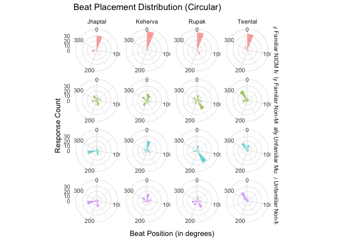<!-- -->

``` r
# Plot 2: with beat positions
pc2 <- data2 %>%
  ggplot(aes(x = corrected_aligned_beats, fill = Overall_Fam)) +
  geom_bar(alpha = 0.7, width = 0.8) +
  coord_polar(start = 0) +
  facet_grid(Overall_Fam ~ rhythm_name, scales = "free_x") +
  scale_x_continuous(
    breaks = function(x) seq(ceiling(min(x)), floor(max(x)), by = 1)
  ) +
  scale_fill_brewer(palette = "Set2") +
  labs(title = "Beat Placement Distribution (Circular)",
       x = NULL,
       y = NULL) +
  theme_minimal(base_size = 14) +
  theme(
    legend.position = "none",
    strip.text = element_text(face = "bold", size = 12),
    panel.grid.major = element_line(color = "gray80", linewidth = 0.3),
    panel.grid.minor = element_blank(),
    axis.text.y = element_blank(),  
    axis.ticks.y = element_blank(), 
    plot.title = element_text(face = "bold", size = 16)
  )

print(pc2)
```

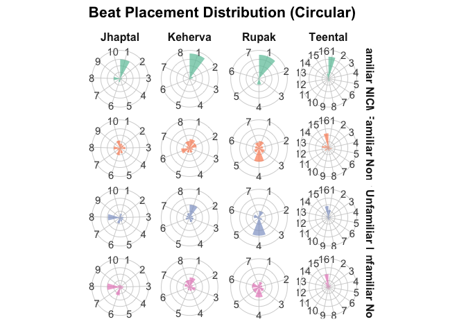<!-- -->

``` r
# Which groups show strongest clustering?
concentration_summary <- circular_stats %>%
  arrange(desc(concentration)) %>%
  select(Overall_Fam, rhythm_name, concentration, rayleigh_p)

print(concentration_summary)
```

    ## # A tibble: 16 × 4
    ##    Overall_Fam                         rhythm_name concentration rayleigh_p
    ##    <fct>                               <chr>               <dbl>      <dbl>
    ##  1 Culturally Familiar NICM Musicians  Keherva            0.804    4.79e-15
    ##  2 Culturally Familiar NICM Musicians  Teental            0.728    1.81e-12
    ##  3 Culturally Familiar NICM Musicians  Rupak              0.579    2.21e- 8
    ##  4 Culturally Unfamiliar Non-Musicians Teental            0.461    1.84e- 6
    ##  5 Culturally Familiar NICM Musicians  Jhaptal            0.454    3.28e- 5
    ##  6 Culturally Unfamiliar Musicians     Teental            0.410    5.82e- 5
    ##  7 Culturally Familiar Non-Musicians   Teental            0.374    2.43e- 5
    ##  8 Culturally Unfamiliar Musicians     Rupak              0.347    1.06e- 3
    ##  9 Culturally Unfamiliar Non-Musicians Jhaptal            0.333    1.04e- 3
    ## 10 Culturally Unfamiliar Musicians     Keherva            0.276    1.11e- 2
    ## 11 Culturally Unfamiliar Musicians     Jhaptal            0.245    3.12e- 2
    ## 12 Culturally Unfamiliar Non-Musicians Keherva            0.242    2.66e- 2
    ## 13 Culturally Unfamiliar Non-Musicians Rupak              0.227    4.14e- 2
    ## 14 Culturally Familiar Non-Musicians   Rupak              0.158    1.76e- 1
    ## 15 Culturally Familiar Non-Musicians   Keherva            0.129    2.96e- 1
    ## 16 Culturally Familiar Non-Musicians   Jhaptal            0.0408   8.90e- 1

# Beat Position Alignment by Group

This section examines which beat positions different participant groups
aligned to.

``` r
# Summary of beat position choices
position_summary <- data2 %>%
  group_by(Overall_Fam, rhythm_name, corrected_aligned_beats) %>%
  summarise(n = n(), .groups = "drop") %>%
  group_by(Overall_Fam, rhythm_name) %>%
  mutate(percentage = round((n / sum(n)) * 100, 1))


max_alignment <- position_summary %>%
  group_by(Overall_Fam, rhythm_name) %>%
  slice_max(n, n = 1, with_ties = FALSE) %>%
  dplyr::select(Overall_Fam, rhythm_name, 
                most_common_beat = corrected_aligned_beats, 
                count = n, percentage) %>%
  ungroup()

kable(max_alignment, 
      caption = "Most Frequently Chosen Beat Position by Group and Rhythm")
```

| Overall_Fam | rhythm_name | most_common_beat | count | percentage |
|:---|:---|---:|---:|---:|
| Culturally Familiar NICM Musicians | Jhaptal | 1 | 30 | 60.0 |
| Culturally Familiar NICM Musicians | Keherva | 1 | 39 | 76.5 |
| Culturally Familiar NICM Musicians | Rupak | 1 | 37 | 75.5 |
| Culturally Familiar NICM Musicians | Teental | 1 | 34 | 66.7 |
| Culturally Familiar Non-Musicians | Jhaptal | 10 | 12 | 17.1 |
| Culturally Familiar Non-Musicians | Keherva | 1 | 14 | 19.2 |
| Culturally Familiar Non-Musicians | Rupak | 4 | 21 | 30.0 |
| Culturally Familiar Non-Musicians | Teental | 16 | 23 | 30.3 |
| Culturally Unfamiliar Musicians | Jhaptal | 8 | 19 | 32.8 |
| Culturally Unfamiliar Musicians | Keherva | 1 | 20 | 33.9 |
| Culturally Unfamiliar Musicians | Rupak | 4 | 28 | 49.1 |
| Culturally Unfamiliar Musicians | Teental | 16 | 18 | 31.0 |
| Culturally Unfamiliar Non-Musicians | Jhaptal | 8 | 20 | 32.3 |
| Culturally Unfamiliar Non-Musicians | Keherva | 1 | 15 | 24.2 |
| Culturally Unfamiliar Non-Musicians | Rupak | 4 | 16 | 25.8 |
| Culturally Unfamiliar Non-Musicians | Teental | 16 | 20 | 32.3 |

Most Frequently Chosen Beat Position by Group and Rhythm

``` r
# Reshape to show all groups side-by-side for each rhythm
beat_summary_wide <- position_summary %>%
  group_by(Overall_Fam, rhythm_name) %>%
  slice_max(n, n = 1, with_ties = FALSE) %>%
  ungroup() %>%
  dplyr::select(Overall_Fam, rhythm_name, corrected_aligned_beats, percentage) %>%
  mutate(summary = paste0("Beat ", corrected_aligned_beats, " (", percentage, "%)")) %>%
  dplyr::select(-corrected_aligned_beats, -percentage) %>%
  pivot_wider(names_from = Overall_Fam, values_from = summary)

kable(beat_summary_wide, 
      caption = "Most Common Beat Choice by Group (with percentage)")
```

| rhythm_name | Culturally Familiar NICM Musicians | Culturally Familiar Non-Musicians | Culturally Unfamiliar Musicians | Culturally Unfamiliar Non-Musicians |
|:---|:---|:---|:---|:---|
| Jhaptal | Beat 1 (60%) | Beat 10 (17.1%) | Beat 8 (32.8%) | Beat 8 (32.3%) |
| Keherva | Beat 1 (76.5%) | Beat 1 (19.2%) | Beat 1 (33.9%) | Beat 1 (24.2%) |
| Rupak | Beat 1 (75.5%) | Beat 4 (30%) | Beat 4 (49.1%) | Beat 4 (25.8%) |
| Teental | Beat 1 (66.7%) | Beat 16 (30.3%) | Beat 16 (31%) | Beat 16 (32.3%) |

Most Common Beat Choice by Group (with percentage)

Binomial to see if the beat has been chosen above chance

``` r
# Circular plot showing beat position choices
pc_alignment <- data2 %>%
  ggplot(aes(x = corrected_aligned_beats, fill = Overall_Fam)) +
  geom_bar(alpha = 0.7, width = 0.8) +
  coord_polar(start = -pi/2+ pi/2.4) +
  facet_grid(
    Overall_Fam ~ factor(rhythm_name,
                         levels = c("Rupak", "Keherva", "Jhaptal", "Teental")),
    scales = "free_x",
    labeller = as_labeller(c(
  # rhythm labels
  "Rupak"   = "7-Rupaktal",
  "Keherva" = "8-Kehervatal",
  "Jhaptal" = "10-Jhaptal",
  "Teental" = "16-Teental",
  # group labels
  "Culturally Familiar NICM Musicians"    = "Culturally Familiar\nNICM Musicians",
  "Culturally Familiar Non-Musicians"     = "Culturally Familiar\nNon-Musicians",
  "Culturally Unfamiliar Musicians"       = "Culturally Unfamiliar\nMusicians",
  "Culturally Unfamiliar Non-Musicians"   = "Culturally Unfamiliar\nNon-Musicians"
))
  ) +
  scale_x_continuous(
    breaks = function(x) seq(ceiling(min(x)), floor(max(x)), by = 1)
  ) +
  scale_fill_brewer(palette = "Set2") +
  labs(
    x = "Beat Position",
    y = NULL
  ) +
  theme_minimal(base_size = 12) +
  theme(
    legend.position = "none",
    strip.text = element_text(face = "bold", size = 11),
    strip.text.y = element_text(angle = 0, hjust = 0),
    panel.grid.major = element_line(color = "gray80", linewidth = 0.3),
    panel.grid.minor = element_blank(),
    axis.text.y = element_blank(),  
    axis.ticks.y = element_blank(),
    plot.title = element_text(face = "bold", size = 16)
  )

print(pc_alignment)
```

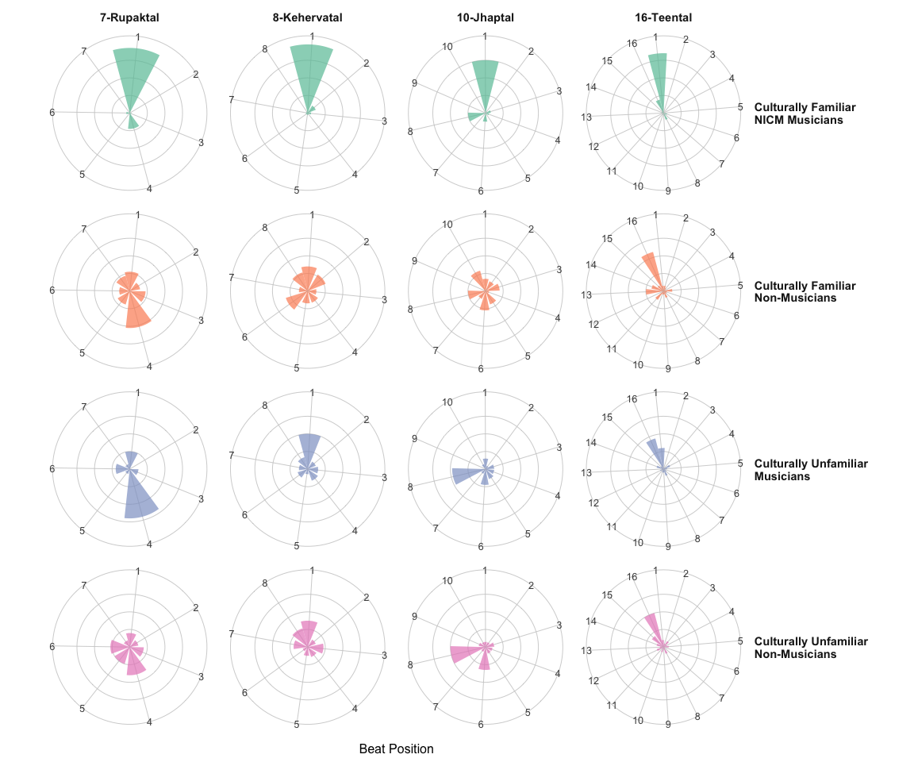<!-- -->

``` r
#ggsave("figure2.tif", plot = pc_alignment, dpi = 300, width = 12, height = 10, units = "in")
```

# Circular Template Visualizations

``` r
# Prepare data with template indicators
template_positions <- data2 %>%
  mutate(
    is_T1 = case_when(
      rhythm_name == "Rupak" & corrected_aligned_beats %in% c(4,6) ~ TRUE,
      rhythm_name == "Keherva" & corrected_aligned_beats %in% c(1,3,5,8) ~ TRUE,
      rhythm_name == "Jhaptal" & corrected_aligned_beats %in% c(1,3,4,6,8,9) ~ TRUE,
      rhythm_name == "Teental" & corrected_aligned_beats %in% c(1,4,5,8,9,16) ~ TRUE,
      TRUE ~ FALSE
    ),
    is_T2 = case_when(
      rhythm_name == "Rupak" & corrected_aligned_beats == 4 ~ TRUE,
      rhythm_name == "Keherva" & corrected_aligned_beats == 8 ~ TRUE,
      rhythm_name == "Jhaptal" & corrected_aligned_beats %in% c(3,8) ~ TRUE,
      rhythm_name == "Teental" & corrected_aligned_beats %in% c(4,8,16) ~ TRUE,
      TRUE ~ FALSE
    ),
    is_T3 = case_when(
      rhythm_name == "Rupak" & corrected_aligned_beats %in% c(1,4,6) ~ TRUE,
      rhythm_name == "Keherva" & corrected_aligned_beats %in% c(1,5) ~ TRUE,
      rhythm_name == "Jhaptal" & corrected_aligned_beats %in% c(1,4,6,9) ~ TRUE,
      rhythm_name == "Teental" & corrected_aligned_beats %in% c(1,5,9,13) ~ TRUE,
      TRUE ~ FALSE
    ),
    is_T4 = case_when(
      rhythm_name == "Rupak" & corrected_aligned_beats == 4 ~ TRUE,
      rhythm_name == "Keherva" & corrected_aligned_beats == 5 ~ TRUE,
      rhythm_name == "Jhaptal" & corrected_aligned_beats == 8 ~ TRUE,
      rhythm_name == "Teental" & corrected_aligned_beats == 16 ~ TRUE,
      TRUE ~ FALSE
    )
  )

# Calculate max count for proper scaling
max_count <- template_positions %>%
  count(Overall_Fam, rhythm_name, corrected_aligned_beats) %>%
  pull(n) %>%
  max()

# Create reference points for template markers (outside the circle)
create_template_markers <- function(data, template_col, color, label) {
  data %>%
    filter({{template_col}}) %>%
    count(Overall_Fam, rhythm_name, corrected_aligned_beats) %>%
    mutate(
      marker_radius = max_count * 1.15,  # Place markers outside
      template_name = label,
      template_color = color
    )
}

# Create markers for each template
T1_markers <- create_template_markers(template_positions, is_T1, "#E41A1C", "T1")
T2_markers <- create_template_markers(template_positions, is_T2, "#377EB8", "T2")
T3_markers <- create_template_markers(template_positions, is_T3, "#4DAF4A", "T3")
T4_markers <- create_template_markers(template_positions, is_T4, "#984EA3", "T4")

# Template 1 Plot
pc_T1 <- template_positions %>%
  ggplot(aes(x = corrected_aligned_beats)) +
  geom_bar(aes(fill = Overall_Fam), alpha = 0.7, width = 0.9) +
  # Add template markers as points outside the circle
  geom_point(data = T1_markers,
             aes(y = marker_radius, color = "Template 1\n(Onset Accents)"),
             size = 5, shape = 16) +
  coord_polar(start = -pi/2 + pi/2.4) +
  facet_grid(Overall_Fam ~ rhythm_name, scales = "free_x") +
  scale_x_continuous(
    breaks = function(x) seq(ceiling(min(x)), floor(max(x)), by = 1)
  ) +
  scale_fill_brewer(palette = "Set2", name = "Group") +
  scale_color_manual(values = c("Template 1\n(Onset Accents)" = "#E41A1C"),
                     name = NULL) +
  scale_y_continuous(limits = c(0, max_count * 1.2)) +
  labs(
    title = "Template 1: Beat Onset Accents",
    subtitle = "Red dots mark positions with onset accents",
    x = "Beat Position",
    y = NULL
  ) +
  theme_minimal(base_size = 13) +
  theme(
    legend.position = "bottom",
    strip.text = element_text(face = "bold", size = 11),
    strip.text.y = element_text(angle = 0, hjust = 0),
    panel.grid.major = element_line(color = "gray85", linewidth = 0.4),
    panel.grid.minor = element_blank(),
    axis.text.y = element_blank(),
    axis.ticks.y = element_blank(),
    plot.title = element_text(face = "bold", size = 16),
    plot.subtitle = element_text(size = 12, color = "gray30"),
    panel.spacing = unit(1, "lines")
  )

print(pc_T1)
```

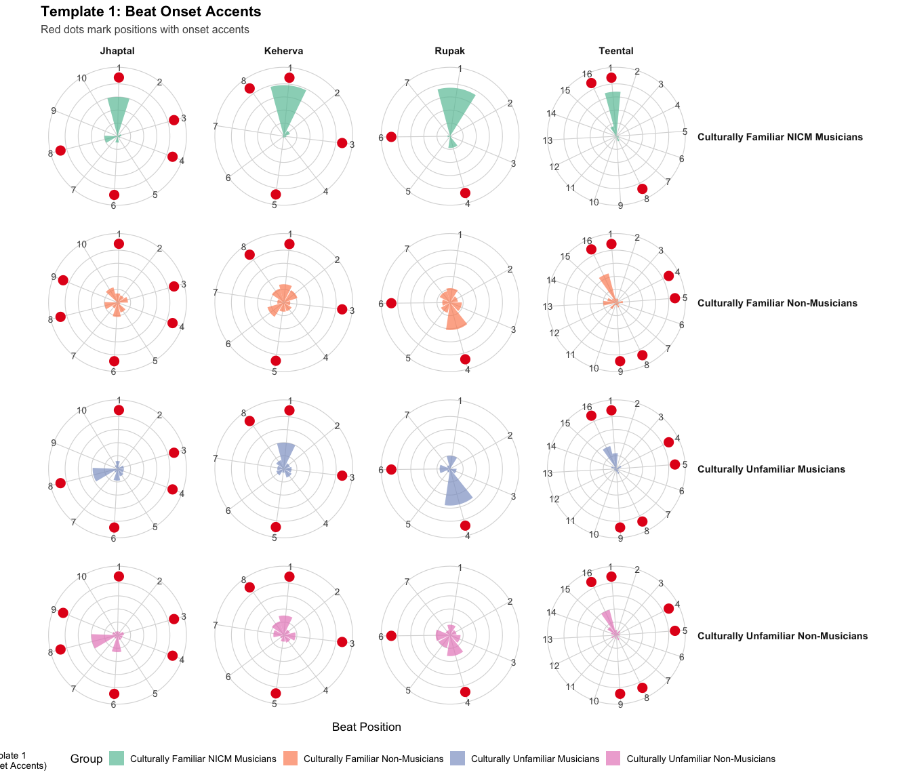<!-- -->

``` r
# Template 2 Plot
pc_T2 <- template_positions %>%
  ggplot(aes(x = corrected_aligned_beats)) +
  geom_bar(aes(fill = Overall_Fam), alpha = 0.7, width = 0.9) +
  geom_point(data = T2_markers,
             aes(y = marker_radius, color = "Template 2\n(Consecutive Beats)"),
             size = 5, shape = 16) +
  coord_polar(start = -pi/2 + pi/2.5) +
  facet_grid(Overall_Fam ~ rhythm_name, scales = "free_x") +
  scale_x_continuous(
    breaks = function(x) seq(ceiling(min(x)), floor(max(x)), by = 1)
  ) +
  scale_fill_brewer(palette = "Set2", name = "Group") +
  scale_color_manual(values = c("Template 2\n(Consecutive Beats)" = "#377EB8"),
                     name = NULL) +
  scale_y_continuous(limits = c(0, max_count * 1.2)) +
  labs(
    title = "Template 2: Consecutive Accent Pattern",
    subtitle = "Blue dots mark first position of consecutive accents",
    x = "Beat Position",
    y = NULL
  ) +
  theme_minimal(base_size = 13) +
  theme(
    legend.position = "bottom",
    strip.text = element_text(face = "bold", size = 11),
    strip.text.y = element_text(angle = 0, hjust = 0),
    panel.grid.major = element_line(color = "gray85", linewidth = 0.4),
    panel.grid.minor = element_blank(),
    axis.text.y = element_blank(),
    axis.ticks.y = element_blank(),
    plot.title = element_text(face = "bold", size = 16),
    plot.subtitle = element_text(size = 12, color = "gray30"),
    panel.spacing = unit(1, "lines")
  )

print(pc_T2)
```

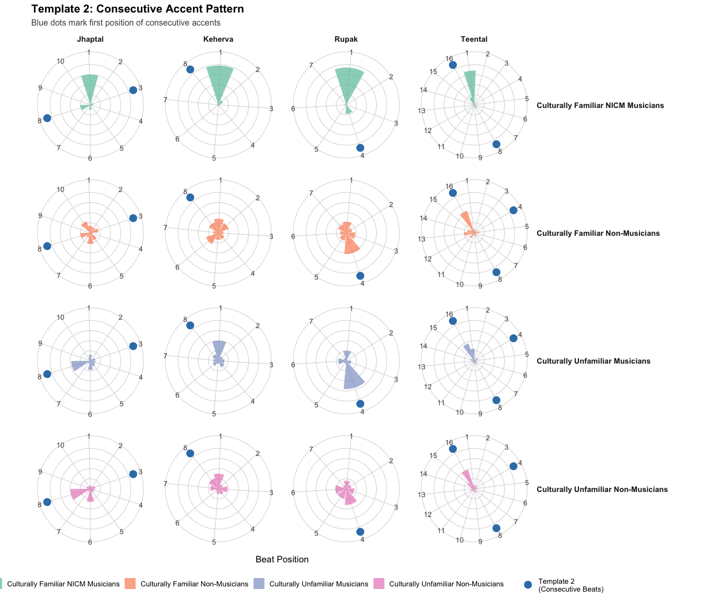<!-- -->

``` r
# Template 3 Plot
pc_T3 <- template_positions %>%
  ggplot(aes(x = corrected_aligned_beats)) +
  geom_bar(aes(fill = Overall_Fam), alpha = 0.7, width = 0.9) +
  geom_point(data = T3_markers,
             aes(y = marker_radius, color = "Template 3\n(Chunk Boundaries)"),
             size = 5, shape = 16) +
  coord_polar(start = -pi/2 + pi/2.5) +
  facet_grid(Overall_Fam ~ rhythm_name, scales = "free_x") +
  scale_x_continuous(
    breaks = function(x) seq(ceiling(min(x)), floor(max(x)), by = 1)
  ) +
  scale_fill_brewer(palette = "Set2", name = "Group") +
  scale_color_manual(values = c("Template 3\n(Chunk Boundaries)" = "#4DAF4A"),
                     name = NULL) +
  scale_y_continuous(limits = c(0, max_count * 1.2)) +
  labs(
    title = "Template 3: Grouping Boundary Markers",
    subtitle = "Green dots mark chunk/subdivision boundaries",
    x = "Beat Position",
    y = NULL
  ) +
  theme_minimal(base_size = 13) +
  theme(
    legend.position = "bottom",
    strip.text = element_text(face = "bold", size = 11),
    strip.text.y = element_text(angle = 0, hjust = 0),
    panel.grid.major = element_line(color = "gray85", linewidth = 0.4),
    panel.grid.minor = element_blank(),
    axis.text.y = element_blank(),
    axis.ticks.y = element_blank(),
    plot.title = element_text(face = "bold", size = 16),
    plot.subtitle = element_text(size = 12, color = "gray30"),
    panel.spacing = unit(1, "lines")
  )

print(pc_T3)
```

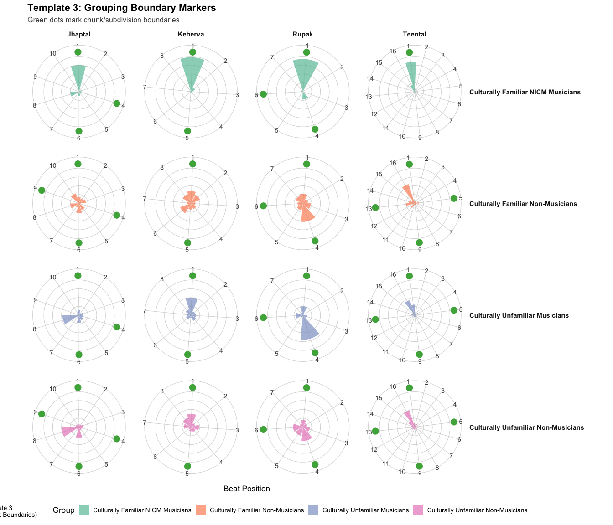<!-- -->

``` r
# Template 4 Plot
pc_T4 <- template_positions %>%
  ggplot(aes(x = corrected_aligned_beats)) +
  geom_bar(aes(fill = Overall_Fam), alpha = 0.7, width = 0.9) +
  geom_point(data = T4_markers,
             aes(y = marker_radius, color = "Template 4\n(Weak-to-Strong)"),
             size = 5, shape = 16) +
  coord_polar(start = -pi/2 + pi/2.5) +
  facet_grid(Overall_Fam ~ rhythm_name, scales = "free_x") +
  scale_x_continuous(
    breaks = function(x) seq(ceiling(min(x)), floor(max(x)), by = 1)
  ) +
  scale_fill_brewer(palette = "Set2", name = "Group") +
  scale_color_manual(values = c("Template 4\n(Weak-to-Strong)" = "#984EA3"),
                     name = NULL) +
  scale_y_continuous(limits = c(0, max_count * 1.2)) +
  labs(
    title = "Template 4: Weak-to-Strong Transition",
    subtitle = "Purple dots mark weak-to-strong beat positions",
    x = "Beat Position",
    y = NULL
  ) +
  theme_minimal(base_size = 13) +
  theme(
    legend.position = "bottom",
    strip.text = element_text(face = "bold", size = 11),
    strip.text.y = element_text(angle = 0, hjust = 0),
    panel.grid.major = element_line(color = "gray85", linewidth = 0.4),
    panel.grid.minor = element_blank(),
    axis.text.y = element_blank(),
    axis.ticks.y = element_blank(),
    plot.title = element_text(face = "bold", size = 16),
    plot.subtitle = element_text(size = 12, color = "gray30"),
    panel.spacing = unit(1, "lines")
  )

print(pc_T4)
```

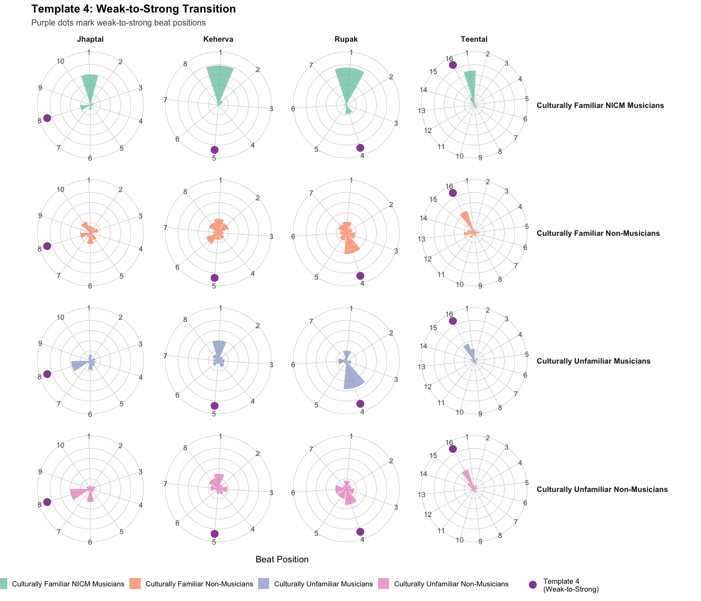<!-- -->

``` r
# Combined plot with all templates
all_markers <- bind_rows(
  T1_markers %>% mutate(template = "T1: Onset Accents", color = "#E41A1C"),
  T2_markers %>% mutate(template = "T2: Consecutive", color = "#377EB8"),
  T3_markers %>% mutate(template = "T3: Chunk Boundaries", color = "#4DAF4A"),
  T4_markers %>% mutate(template = "T4: Weak-to-Strong", color = "#984EA3")
)

pc_combined <- template_positions %>%
  ggplot(aes(x = corrected_aligned_beats)) +
  geom_bar(aes(fill = Overall_Fam), alpha = 0.7, width = 0.9) +
  geom_point(data = all_markers,
             aes(y = marker_radius, color = template, shape = template),
             size = 4.5) +
  coord_polar(start = -pi/2 + pi/2.5) +
  facet_grid(Overall_Fam ~ rhythm_name, scales = "free_x") +
  scale_x_continuous(
    breaks = function(x) seq(ceiling(min(x)), floor(max(x)), by = 1)
  ) +
  scale_fill_brewer(palette = "Set2", name = "Group") +
  scale_color_manual(
    values = c("T1: Onset Accents" = "#E41A1C",
               "T2: Consecutive" = "#377EB8",
               "T3: Chunk Boundaries" = "#4DAF4A",
               "T4: Weak-to-Strong" = "#984EA3"),
    name = "Templates"
  ) +
  scale_shape_manual(
    values = c("T1: Onset Accents" = 16,
               "T2: Consecutive" = 17,
               "T3: Chunk Boundaries" = 15,
               "T4: Weak-to-Strong" = 18),
    name = "Templates"
  ) +
  scale_y_continuous(limits = c(0, max_count * 1.25)) +
  labs(
    title = "All Templates: Beat Position Distribution with Template Markers",
    subtitle = "Colored shapes outside circles indicate template positions",
    x = "Beat Position",
    y = NULL
  ) +
  theme_minimal(base_size = 13) +
  theme(
    legend.position = "bottom",
    strip.text = element_text(face = "bold", size = 11),
    strip.text.y = element_text(angle = 0, hjust = 0),
    panel.grid.major = element_line(color = "gray85", linewidth = 0.4),
    panel.grid.minor = element_blank(),
    axis.text.y = element_blank(),
    axis.ticks.y = element_blank(),
    plot.title = element_text(face = "bold", size = 16),
    plot.subtitle = element_text(size = 12, color = "gray30"),
    panel.spacing = unit(1, "lines")
  )

print(pc_combined)
```

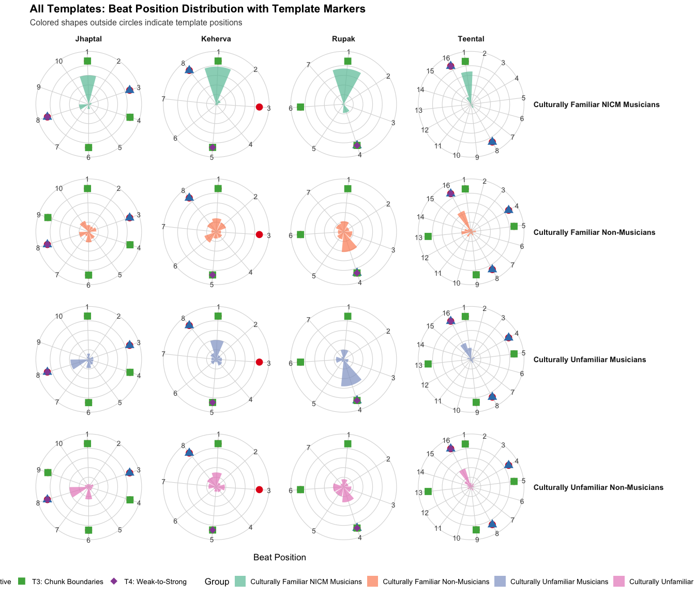<!-- -->

# Looking at the Stimuli through MIR

``` r
#import csv with MIR in matlb

#importing tuomas's: high low flux

# Load Rupak
rupak_low <- read.csv("flux_variables/Rupak_flux_low_peaks.csv", header = FALSE)
rupak_high <- read.csv("flux_variables/Rupak_flux_high_peaks.csv", header = FALSE)
colnames(rupak_low) <- c("time", "flux")
colnames(rupak_high) <- c("time", "flux")
rupak_low <- rupak_low %>% filter(time < 5) %>% mutate(band = "Low", rhythm_name = "Rupak", beats_per_cycle = 7)
rupak_high <- rupak_high %>% filter(time < 5) %>% mutate(band = "High", rhythm_name = "Rupak", beats_per_cycle = 7)

# Load Keherva
keherva_low <- read.csv("flux_variables/Keherva_flux_low_peaks.csv", header = FALSE)
keherva_high <- read.csv("flux_variables/Keherva_flux_high_peaks.csv", header = FALSE)
colnames(keherva_low) <- c("time", "flux")
colnames(keherva_high) <- c("time", "flux")
keherva_low <- keherva_low %>% filter(time < 5) %>% mutate(band = "Low", rhythm_name = "Keherva", beats_per_cycle = 8)
keherva_high <- keherva_high %>% filter(time < 5) %>% mutate(band = "High", rhythm_name = "Keherva", beats_per_cycle = 8)

# Load Jhaptal
jhaptal_low <- read.csv("flux_variables/Jhaptal_flux_low_peaks.csv", header = FALSE)
jhaptal_high <- read.csv("flux_variables/Jhaptal_flux_high_peaks.csv", header = FALSE)
colnames(jhaptal_low) <- c("time", "flux")
colnames(jhaptal_high) <- c("time", "flux")
jhaptal_low <- jhaptal_low %>% filter(time < 5) %>% mutate(band = "Low", rhythm_name = "Jhaptal", beats_per_cycle = 10)
jhaptal_high <- jhaptal_high %>% filter(time < 5) %>% mutate(band = "High", rhythm_name = "Jhaptal", beats_per_cycle = 10)

# Load Teental
teental_low <- read.csv("flux_variables/Teental_flux_low_peaks.csv", header = FALSE)
teental_high <- read.csv("flux_variables/Teental_flux_high_peaks.csv", header = FALSE)
colnames(teental_low) <- c("time", "flux")
colnames(teental_high) <- c("time", "flux")
teental_low <- teental_low %>% filter(time < 5) %>% mutate(band = "Low", rhythm_name = "Teental", beats_per_cycle = 16)
teental_high <- teental_high %>% filter(time < 5) %>% mutate(band = "High", rhythm_name = "Teental", beats_per_cycle = 16)

# Combine all data
all_data <- bind_rows(
  rupak_low, rupak_high,
  keherva_low, keherva_high,
  jhaptal_low, jhaptal_high,
  teental_low, teental_high
)

# Calculate beat positions
beat_positions <- all_data %>%
  distinct(rhythm_name, beats_per_cycle) %>%
  rowwise() %>%
  mutate(beat_times = list(seq(0, 5, length.out = beats_per_cycle + 1))) %>%
  unnest(beat_times) %>%
  filter(beat_times < 5)

# PLOT 1: Just acoustic peaks
pmir<- ggplot() +
   geom_vline(data = beat_positions, 
             aes(xintercept = beat_times), 
             color = "gray80", linetype = "dotted") +
  
  geom_point(data = all_data, 
             aes(x = time, y = flux, color = band, shape = band), 
             size = 3, alpha = 0.8) +
  
  facet_wrap(~rhythm_name, ncol = 2, scales = "free") +
  
  scale_color_manual(values = c("Low" = "#2E86AB", 
                                  "High" = "#A23B72")) +
  scale_shape_manual(values = c("Low" = 16, "High" = 17)) +
  
  labs(
    title = "Detected Onsets - First Cycle (5 seconds)",
    subtitle = "Gray lines = beat positions",
    x = "Time (seconds)",
    y = "Spectral Flux Value",
    color = "Frequency Band",
    shape = "Frequency Band"
  ) +
  theme_minimal() +
  theme(
    legend.position = "bottom",
    strip.text = element_text(face = "bold", size = 12),
    panel.grid.major = element_blank(),
    panel.grid.minor = element_blank(),
    axis.line = element_line(color = "black", size = 0.5)
  )
```

    ## Warning: The `size` argument of `element_line()` is deprecated as of ggplot2 3.4.0.
    ## ℹ Please use the `linewidth` argument instead.
    ## This warning is displayed once every 8 hours.
    ## Call `lifecycle::last_lifecycle_warnings()` to see where this warning was
    ## generated.

``` r
#ggsave("figuremir.png", plot = pmir, dpi = 300, width = 12, height = 10, units = "in")

# Prepare participant data
participant_responses <- data2 %>%
  filter(!is.na(corrected_aligned_beats)) %>%
  mutate(
    beat_time = (corrected_aligned_beats - 1) * (5 / beats_per_cycle)
  )

response_counts <- participant_responses %>%
  group_by(rhythm_name, corrected_aligned_beats, beat_time) %>%
  summarise(n_responses = n(), .groups = "drop")

# PLOT 2: Participant responses with acoustic peaks
ggplot() +
  geom_vline(data = beat_positions, 
             aes(xintercept = beat_times), 
             color = "gray80", linetype = "dotted") +
  geom_histogram(data = response_counts,
                 aes(x = beat_time, y = n_responses),
                 stat = "identity",
                 fill = "lightblue", 
                 alpha = 0.4) +
  
  geom_point(data = all_data, 
             aes(x = time, y = flux, color = band, shape = band), 
             size = 3, alpha = 0.8) +
  
  facet_wrap(~rhythm_name, ncol = 2, scales = "free") +
  
  scale_color_manual(values = c("Low" = "#2E86AB", "High" = "#A23B72")) +
  scale_shape_manual(values = c("Low" = 16, "High" = 17)) +
  
  labs(
    title = "Participant Responses vs Acoustic Peaks",
    subtitle = "Blue bars = participant beat choices | Points = acoustic onsets",
    x = "Time (seconds)",
    y = "Count / Flux Value",
    color = "Acoustic Peaks",
    shape = "Acoustic Peaks"
  ) +
  theme_minimal() +
  theme(
    legend.position = "bottom",
    strip.text = element_text(face = "bold", size = 12),
    panel.grid.major = element_blank(),
    panel.grid.minor = element_blank(),
    axis.line = element_line(color = "black", size = 0.5)
  )
```

    ## Warning in geom_histogram(data = response_counts, aes(x = beat_time, y =
    ## n_responses), : Ignoring unknown parameters: `binwidth`, `bins`, and `pad`

<!-- -->

So, where I see both high and low are probably the positions where there
is the emphasis. It is still not as good as the manual template 1
